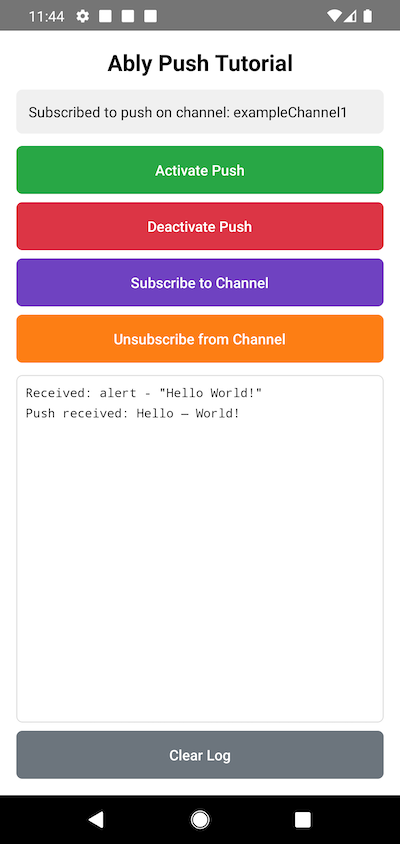

This guide will get you started with Ably Push Notifications in a new React Native application.

You'll learn how to set up your application with Firebase Cloud Messaging (FCM), register devices with Ably, send push notifications, subscribe to channel-based push, and handle incoming notifications on both iOS and Android.

## Prerequisites <a id="prerequisites"/>

1. [Sign up](https://ably.com/signup) for an Ably account.
2. Create a [new app](https://ably.com/accounts/any/apps/new), and create your first API key in the **API Keys** tab of the dashboard.
3. Your API key needs the `publish`, `subscribe`, and `push-admin` capabilities.
4. For channel-based push, add a rule for the channel with **Push notifications enabled** checked. In the dashboard left sidebar: **Configuration** → **Rules** → **Add** or **Edit** a rule, then enable the Push notifications option. See [channel rules](/docs/channels#rules) for details.
5. Install [Node.js](https://nodejs.org/) 18 or higher.
6. Set up your React Native development environment following the [React Native CLI Quickstart](https://reactnative.dev/docs/set-up-your-environment).
7. For iOS: Install [Xcode](https://developer.apple.com/xcode/). Push notifications require a physical iOS device (simulators do not support push).
8. For Android: Install [Android Studio](https://developer.android.com/studio). Use a physical device or an emulator with Google Play Services installed.

### (Optional) Install Ably CLI <a id="install-cli"/>

Use the [Ably CLI](https://github.com/ably/cli) as an additional client to quickly test Pub/Sub features and push notifications.

1. Install the Ably CLI:

<Code>
```shell
npm install -g @ably/cli
```
</Code>

2. Run the following to log in to your Ably account and set the default app and API key:

<Code>
```shell
ably login
```
</Code>

### Set up Firebase Cloud Messaging <a id="setup-fcm"/>

Firebase Cloud Messaging delivers push notifications for both Android and iOS. To enable FCM:

1. Go to the [Firebase Console](https://console.firebase.google.com/) and create a new project (or use an existing one).
2. Register your Android app using your package name. Download `google-services.json` and place it in `android/app/`.
3. Download your Firebase service account JSON file from your Firebase console: **Project configuration** → **Service Accounts** → **Generate new private key**.
4. In the Ably dashboard left sidebar, navigate to your app's **Push Notifications**.
5. Scroll to the **Configure push service for devices** section and press **Configure Push**.
6. Upload your Firebase service account JSON file in **Setting up Firebase Cloud Messaging** section.
7. In the [Apple Developer portal](https://developer.apple.com), go to **Certificates, Identifiers & Profiles** → **Keys**.
8. Add a new key and check **Apple Push Notifications service (APNs)**, click **Register**.
9. Download the `.p8` file — you can only download it once. Note your **Key ID** and **Team ID**.
10. In the Firebase Console, go to **Project configuration** → **Cloud Messaging** → **Apple App Setup** → **APNS authentication key** to upload your `.p8` file.
11. Register an iOS app in your Firebase project using your bundle identifier. Download `GoogleService-Info.plist` and add it to your Xcode project's root target.

### Create a React Native project <a id="create-project"/>

Create a new React Native project and install the required dependencies:

<Code>
```shell
npx react-native@latest init PushTutorial
cd PushTutorial
npm install ably @react-native-firebase/app @react-native-firebase/messaging @notifee/react-native
```
</Code>

#### Configure Android project <a id="configure-android"/>

Apply the Google Services plugin in `android/build.gradle`:

```kotlin
// android/build.gradle
buildscript {
    dependencies {
        classpath('com.google.gms:google-services:4.4.2')
    }
}
```

Then apply it in `android/app/build.gradle`:

```kotlin
// android/app/build.gradle
apply plugin: 'com.google.gms.google-services'
```

Also declare the `POST_NOTIFICATIONS` permission in `android/app/src/main/AndroidManifest.xml`:

```xml
<manifest xmlns:android="http://schemas.android.com/apk/res/android">
    <uses-permission android:name="android.permission.INTERNET" />
    <uses-permission android:name="android.permission.POST_NOTIFICATIONS" />
    ...
</manifest>
```

<Aside data-type='note'>
At the time of writing React Native Gradle plugin is not compatible with Gradle 9. If you see a `JvmVendorSpec.IBM_SEMERU` error during the Android build, update `android/gradle/wrapper/gradle-wrapper.properties` to use Gradle 8.13: `distributionUrl=https\://services.gradle.org/distributions/gradle-8.13-bin.zip`.
</Aside>

#### Configure iOS project <a id="configure-ios"/>

Open `ios/PushTutorial.xcworkspace` in Xcode and add the `Push Notifications` capability: select your target, go to **Signing & Capabilities**, and click **+ Capability**.

Add `use_modular_headers!` to `ios/Podfile` after `prepare_react_native_project!`:

```ruby
prepare_react_native_project!
use_modular_headers!
```

This is required for Firebase Swift pods (`FirebaseCoreInternal`, `GoogleUtilities`) to be integrated as static libraries. Then install the native pods:

<Code>
```shell
cd ios && pod install && cd ..
```
</Code>

Then add `FirebaseApp.configure()` to `AppDelegate.swift` before React Native starts:

```swift
import Firebase

func application(
  _ application: UIApplication,
  didFinishLaunchingWithOptions launchOptions: [UIApplication.LaunchOptionsKey: Any]? = nil
) -> Bool {
  FirebaseApp.configure()
  // ... rest of existing setup
}
```

Add all further code to `App.tsx`.

## Step 1: Set up Ably <a id="step-1"/>

Replace the contents of `App.tsx` with the following to initialize the Ably Realtime client and subscribe to a channel for incoming messages:

<Code>
```react
import React, {useEffect, useRef, useState} from 'react';
import {
  Platform,
  ScrollView,
  StyleSheet,
  Text,
  TouchableOpacity,
  View,
} from 'react-native';
import {SafeAreaView} from 'react-native-safe-area-context';
import * as Ably from 'ably';
import messaging from '@react-native-firebase/messaging';
import notifee, {AuthorizationStatus} from '@notifee/react-native';

const CHANNEL_NAME = 'exampleChannel1';

// Use token authentication in production
const realtime = new Ably.Realtime({
  key: '{{API_KEY}}',
  clientId: 'push-tutorial-client',
});

export default function App() {
  const [status, setStatus] = useState('Ready to start');
  const [log, setLog] = useState<string[]>([]);
  const scrollViewRef = useRef<ScrollView>(null);

  function appendLog(message: string) {
    setLog(prev => [...prev, message]);
  }

  function showStatus(message: string) {
    setStatus(message);
    console.log(message);
  }

  useEffect(() => {
    const channel = realtime.channels.get(CHANNEL_NAME);
    channel.subscribe(message => {
      appendLog(`Received: ${message.name} - ${JSON.stringify(message.data)}`);
    });
    return () => {
      channel.unsubscribe();
    };
  }, []);

  return (
    <SafeAreaView style={styles.safeArea}>
      <View style={styles.container}>
        <Text style={styles.title}>Ably Push Tutorial</Text>
        <View style={styles.statusBox}>
          <Text style={styles.statusText}>{status}</Text>
        </View>
        <ScrollView
          ref={scrollViewRef}
          style={styles.logBox}
          onContentSizeChange={() =>
            scrollViewRef.current?.scrollToEnd({animated: true})
          }>
          {log.map((entry, i) => (
            <Text key={i} style={styles.logEntry}>{entry}</Text>
          ))}
        </ScrollView>
      </View>
    </SafeAreaView>
  );
}

const styles = StyleSheet.create({
  safeArea: {flex: 1, backgroundColor: '#fff'},
  container: {flex: 1, padding: 16},
  title: {fontSize: 22, fontWeight: 'bold', textAlign: 'center', marginBottom: 12},
  statusBox: {backgroundColor: '#f0f0f0', padding: 12, borderRadius: 6, marginBottom: 12},
  statusText: {fontSize: 14},
  logBox: {flex: 1, backgroundColor: '#fff', borderWidth: 1, borderColor: '#ddd', borderRadius: 6, padding: 8},
  logEntry: {fontFamily: Platform.OS === 'ios' ? 'Courier' : 'monospace', fontSize: 12, marginBottom: 4},
});
```
</Code>

Key configuration options:

- `key`: Your Ably API key.
- `clientId`: A unique identifier for this client.

## Step 2: Set up push notifications <a id="step-2"/>

Push notification activation in React Native requires obtaining an FCM registration token and registering the device with Ably. Add the following functions to `App.tsx`:

<Code>
```react
// Generate a unique device ID for this installation
const [deviceId] = useState(
  `push-tutorial-${Platform.OS}-${Math.random().toString(36).slice(2, 9)}`,
);
const tokenRefreshUnsubscribeRef = useRef<(() => void) | null>(null); // To store the FCM token refresh listener unsubscribe function

async function requestPermission(): Promise<boolean> {
  if (Platform.OS === 'android') {
    // Use notifee for consistent permission behavior across Android versions
    const settings = await notifee.requestPermission();
    return settings.authorizationStatus >= AuthorizationStatus.AUTHORIZED;
  }
  // On iOS, request permission using Firebase Messaging which will trigger the native iOS permission dialog
  const authStatus = await messaging().requestPermission();
  return (
    authStatus === messaging.AuthorizationStatus.AUTHORIZED ||
    authStatus === messaging.AuthorizationStatus.PROVISIONAL
  );
}

// Save the device registration with Ably using the FCM token
async function saveDeviceRegistration(token: string) {
  await realtime.push.admin.deviceRegistrations.save({
    id: deviceId,
    clientId: 'push-tutorial-client',
    platform: Platform.OS === 'ios' ? 'ios' : 'android',
    formFactor: 'phone',
    push: {
      recipient: {
        transportType: 'fcm',
        registrationToken: token,
      },
    },
  });
}

async function activatePush() {
  try {
    showStatus('Activating push notifications...');
    const granted = await requestPermission();
    if (!granted) {
      showStatus('Notification permission denied.');
      return;
    }

    await messaging().registerDeviceForRemoteMessages(); // Required to receive push notifications on iOS, no-op on Android
    const fcmToken = await messaging().getToken();
    await saveDeviceRegistration(fcmToken);

    tokenRefreshUnsubscribeRef.current?.();
    tokenRefreshUnsubscribeRef.current = messaging().onTokenRefresh(async newToken => {
      try {
        await saveDeviceRegistration(newToken);
      } catch (error: any) {
        console.error('Failed to update FCM token:', error.message);
      }
    });

    showStatus(`Push activated. Device ID: ${deviceId}`);
    appendLog(`Push activated. Device ID: ${deviceId}`);
  } catch (error: any) {
    showStatus(`Failed to activate push: ${error.message}`);
  }
}

async function deactivatePush() {
  try {
    showStatus('Deactivating push notifications...');
    await realtime.push.admin.deviceRegistrations.remove(deviceId);
    tokenRefreshUnsubscribeRef.current?.();
    tokenRefreshUnsubscribeRef.current = null;
    showStatus('Push notifications deactivated.');
  } catch (error: any) {
    showStatus(`Failed to deactivate push: ${error.message}`);
  }
}
```
</Code>

The `transportType` is set to `fcm` on both platforms because `messaging().getToken()` always returns an FCM registration token, even on iOS. Firebase exchanges the APNs device token for an FCM token internally, so Ably communicates with Firebase rather than APNs directly (instead Firebase sends push notifications to iOS devices via APNs).

`activatePush()` does the following:

1. Requests notification permission from the user.
2. Obtains the FCM registration token from Firebase.
3. Registers the device with Ably's push notification service using the token.

After successful activation, `deviceId` contains the unique device ID assigned to this installation.

<Aside data-type='note'>
The `deviceId` used here is randomly generated on each app start for simplicity. In a production app, persist the device ID (for example using `AsyncStorage`) so that the same device registration is reused across restarts. Without persistence, each app restart creates a new device registration with Ably, orphaning the previous one.
</Aside>

<Aside data-type='note'>
On Android, use `notifee.requestPermission()` instead of React Native's `PermissionsAndroid` because it handles the `POST_NOTIFICATIONS` permission consistently across Android API levels. On iOS, `messaging().requestPermission()` shows the system notification permission dialog; Firebase Messaging calls the native iOS permission APIs internally.
</Aside>

<Aside data-type='note'>
In React Native `realtime.push.activate()` is not used because it's a JS SDK and it registers browser for push notifications, which is not what you want in a React Native app. Instead, use `realtime.push.admin.deviceRegistrations` API to register the device.
</Aside>

## Step 3: Subscribe and test push notifications <a id="step-3"/>

The FCM SDK handles background push notifications automatically and displays them as system notifications. For foreground handling, use `@notifee/react-native` to display notifications while the app is open.

Add the following foreground notification handler to `App.tsx`:

<Code>
```react
useEffect(() => {
  // Create a default Android notification channel
  if (Platform.OS === 'android') {
    notifee.createChannel({id: 'default', name: 'Default Channel'});
  }

  // Handle foreground push messages
  const unsubscribe = messaging().onMessage(async remoteMessage => {
    const title = remoteMessage.notification?.title ?? 'Push Notification';
    const body = remoteMessage.notification?.body ?? '';
    appendLog(`Push received: ${title} — ${body}`);
    await notifee.displayNotification({
      title,
      body,
      android: {channelId: 'default'},
    });
  });

  return () => {
    unsubscribe();
  };
}, []);
```
</Code>

To subscribe your device to a channel so it can receive channel-based push notifications, add the following functions:

<Code>
```react
async function subscribeToChannel() {
  try {
    await realtime.push.admin.channelSubscriptions.save({
      deviceId,
      channel: CHANNEL_NAME,
    });
    showStatus(`Subscribed to push on channel: ${CHANNEL_NAME}`);
  } catch (error: any) {
    showStatus(`Failed to subscribe: ${error.message}`);
  }
}

async function unsubscribeFromChannel() {
  try {
    await realtime.push.admin.channelSubscriptions.remove({
      deviceId,
      channel: CHANNEL_NAME,
    });
    showStatus(`Unsubscribed from push on channel: ${CHANNEL_NAME}`);
  } catch (error: any) {
    showStatus(`Failed to unsubscribe: ${error.message}`);
  }
}
```
</Code>

<Aside data-type='note'>
Sending push notifications using `deviceId` or `clientId` requires the `push-admin` capability for your API key. Use this method for testing purposes. In production, send push notifications from your backend server by publishing messages with a `push` `extras` field to a channel.
</Aside>

Use the Ably CLI to send a test push notification to your client ID:

<Code>
```shell
ably push publish --client-id push-tutorial-client \
  --title "Test push" \
  --body "Hello from CLI!" \
  --data '{"foo":"bar","baz":"qux"}'
```
</Code>

Or send directly to a device ID:

<Code>
```shell
ably push publish --device-id <your-device-id> \
  --title "Test push" \
  --body "Hello from device ID!"
```
</Code>

To send push notifications via a channel, you first need a UI to subscribe to the channel.

## Step 4: Build the UI <a id="step-4"/>

Update the `return` statement in `App.tsx` to add buttons that call all the push functions:

<Code>
```react
return (
  <SafeAreaView style={styles.safeArea}>
    <View style={styles.container}>
      <Text style={styles.title}>Ably Push Tutorial</Text>
      <View style={styles.statusBox}>
        <Text style={styles.statusText}>{status}</Text>
      </View>
      <View style={styles.buttons}>
        <TouchableOpacity style={[styles.btn, styles.btnGreen]} onPress={activatePush}>
          <Text style={styles.btnText}>Activate Push</Text>
        </TouchableOpacity>
        <TouchableOpacity style={[styles.btn, styles.btnRed]} onPress={deactivatePush}>
          <Text style={styles.btnText}>Deactivate Push</Text>
        </TouchableOpacity>
        <TouchableOpacity style={[styles.btn, styles.btnPurple]} onPress={subscribeToChannel}>
          <Text style={styles.btnText}>Subscribe to Channel</Text>
        </TouchableOpacity>
        <TouchableOpacity style={[styles.btn, styles.btnOrange]} onPress={unsubscribeFromChannel}>
          <Text style={styles.btnText}>Unsubscribe from Channel</Text>
        </TouchableOpacity>
      </View>
      <ScrollView
        ref={scrollViewRef}
        style={styles.logBox}
        onContentSizeChange={() =>
          scrollViewRef.current?.scrollToEnd({animated: true})
        }>
        {log.map((entry, i) => (
          <Text key={i} style={styles.logEntry}>{entry}</Text>
        ))}
      </ScrollView>
    </View>
  </SafeAreaView>
);
```
</Code>

Add the button styles to the `StyleSheet.create` call:

<Code>
```react
buttons: {gap: 8, marginBottom: 12},
btn: {padding: 14, borderRadius: 6, alignItems: 'center'},
btnText: {color: '#fff', fontWeight: '600'},
btnGreen: {backgroundColor: '#28a745'},
btnRed: {backgroundColor: '#dc3545'},
btnPurple: {backgroundColor: '#6f42c1'},
btnOrange: {backgroundColor: '#fd7e14'},
btnBlue: {backgroundColor: '#007bff'},
```
</Code>

Build and run your app on a physical device:

<Code>
```shell
# Android
npx react-native run-android

# iOS
npx react-native run-ios --device
```
</Code>

You can also open each platform project in their respective IDEs and run from there.

Tap **Activate Push** and wait until the status message displays your device ID. Try sending a test push notification using the Ably CLI commands shown in Step 3.

### Send push via channel <a id="step-4-send-channel"/>

To test push notifications via channel, tap **Subscribe to Channel** in the app and then publish a message to `exampleChannel1` with a `push` `extras` field using the Ably CLI:

<Code>
```shell
ably channels publish exampleChannel1 '{"name":"example","data":"Hello from CLI!","extras":{"push":{"notification":{"title":"Ably CLI","body":"Hello from CLI!"},"data":{"foo":"bar"}}}}'
```
</Code>

If you tap **Unsubscribe from Channel**, the device no longer receives push notifications for that channel. Send the same command again and verify that no notification is received.

You can also send push notifications directly from your app. The next step shows you how.

## Step 5: Send push with code <a id="step-5"/>

You can send push notifications directly from your app using `deviceId`, `clientId`, or channel publishing. Channel publishing requires `publish` capability but does not require the `push-admin` capability. However, push rules must still be configured on the channel (as set up in prerequisite 4) for the push extras to trigger notifications.

Add the following functions to `App.tsx`:

<Code>
```react
async function sendPushToDevice() {
  try {
    await realtime.push.admin.publish(
      {deviceId},
      {
        notification: {title: 'Push Tutorial', body: 'Hello from device ID!'},
        data: {foo: 'bar', baz: 'qux'},
      },
    );
    showStatus(`Push sent to device ID: ${deviceId}`);
  } catch (error: any) {
    showStatus(`Failed to send push to device: ${error.message}`);
  }
}

async function sendPushToClient() {
  try {
    const clientId = realtime.auth.clientId;
    await realtime.push.admin.publish(
      {clientId},
      {
        notification: {title: 'Push Tutorial', body: 'Hello from client ID!'},
        data: {foo: 'bar', baz: 'qux'},
      },
    );
    showStatus(`Push sent to client ID: ${clientId}`);
  } catch (error: any) {
    showStatus(`Failed to send push to client: ${error.message}`);
  }
}
```
</Code>

To send to a channel, publish a message with a `push` `extras` field:

<Code>
```react
async function sendPushToChannel() {
  try {
    const channel = realtime.channels.get(CHANNEL_NAME);
    await channel.publish({
      name: 'example',
      data: 'Hello from channel!',
      extras: {
        push: {
          notification: {title: 'Channel Push', body: `Sent push to ${CHANNEL_NAME}`},
          data: {foo: 'bar', baz: 'qux'},
        },
      },
    });
    showStatus(`Push sent to channel: ${CHANNEL_NAME}`);
  } catch (error: any) {
    showStatus(`Failed to send push to channel: ${error.message}`);
  }
}
```
</Code>

Add three more buttons to the `buttons` view in your `return` statement:

<Code>
```react
<TouchableOpacity style={[styles.btn, styles.btnBlue]} onPress={sendPushToDevice}>
  <Text style={styles.btnText}>Send Push to Device</Text>
</TouchableOpacity>
<TouchableOpacity style={[styles.btn, styles.btnBlue]} onPress={sendPushToClient}>
  <Text style={styles.btnText}>Send Push to Client</Text>
</TouchableOpacity>
<TouchableOpacity style={[styles.btn, styles.btnBlue]} onPress={sendPushToChannel}>
  <Text style={styles.btnText}>Send Push to Channel</Text>
</TouchableOpacity>
```
</Code>

Build and run your app again. Use the new buttons to send push notifications directly to your device ID, client ID, or the subscribed channel.



## Next steps <a id="next-steps"/>

* Understand [token authentication](/docs/auth/token) before going to production.
* Explore [push notification administration](/docs/push#push-admin) for managing devices and subscriptions.
* Learn about [channel rules](/docs/channels#rules) for channel-based push notifications.
* Read more about the [Push Admin API](/docs/api/realtime-sdk/push-admin).

You can also explore the [Ably JavaScript SDK](https://github.com/ably/ably-js) on GitHub, or visit the [API references](/docs/api/realtime-sdk?lang=javascript) for additional functionality.
