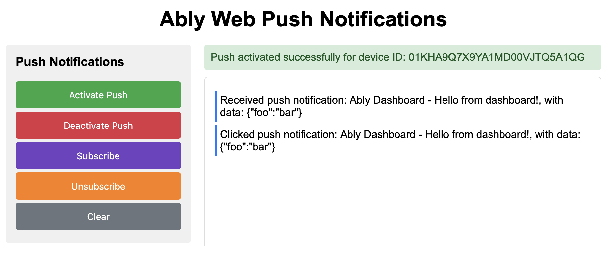
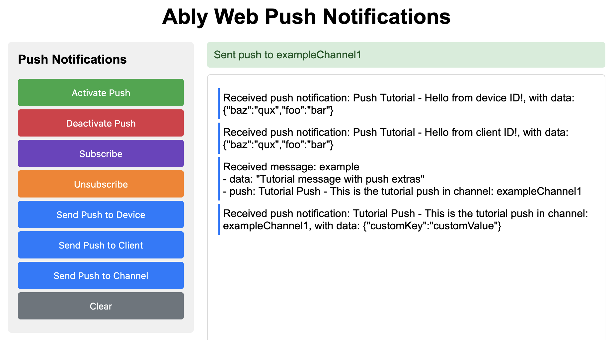

This guide will get you started with Ably Push Notifications in a web application using vanilla JavaScript and a service worker.

You'll learn how to set up an Ably Realtime client with push notification support, register a service worker, activate push notifications, subscribe to channel-based push, send push notifications, and handle incoming notifications in both the service worker and main page.

## Prerequisites <a id="prerequisites"/>

1. [Sign up](https://ably.com/signup) for an Ably account.
2. Create a [new app](https://ably.com/accounts/any/apps/new), and create your first API key in the **API Keys** tab of the dashboard.
3. Your API key will need the `publish` and `subscribe` capabilities. For sending push notifications from your app, you'll also need the `push-admin` capability.
4. For channel-based push, add a rule for the channel with **Push notifications enabled** checked. In the dashboard: go to **Pub/Sub** → **Channels** → **Configure** → **Rules** → **Add** or **Edit** a rule,
then enable the Push notifications option. See [channel rules](https://ably.com/docs/channels#rules) for details.
5. A modern browser that supports the [Push API](https://developer.mozilla.org/en-US/docs/Web/API/Push_API) (Chrome, Firefox, or Edge recommended). Safari has limited Web Push support.
6. A local web server to serve your files over `http://localhost` (service workers require a secure context or localhost).

### (Optional) Install Ably CLI <a id="install-cli"/>

Use the [Ably CLI](https://github.com/ably/cli) as an additional client to quickly test Pub/Sub features and push notifications.

1. Install the Ably CLI:

<Code>
```shell
npm install -g @ably/cli
```
</Code>

2. Run the following to log in to your Ably account and set the default app and API key:

<Code>
```shell
ably login
```
</Code>

### Serve your files locally <a id="serve-locally"/>

Service workers require files to be served from a web server (not opened directly as `file://`).
Navigate to your project directory and use one of the following methods to start a local server:

**Python (built-in on macOS):**

<Code>
```shell
# Python 3
python3 -m http.server 8000
```
</Code>

**Node.js:**

<Code>
```shell
# Install a simple HTTP server globally
npm install -g http-server

# Serve the current directory
http-server -p 8000
```
</Code>

**PHP:**

<Code>
```shell
php -S localhost:8000
```
</Code>

Then open your browser at `http://localhost:8000`.

### Project structure <a id="project-structure"/>

Your project consists of two files:

- `index.html` — the main page with UI and Ably client logic.
- `service-worker.js` — the service worker that handles push events and notification clicks.

## Step 1: Set up Ably <a id="step-1"/>

This step initializes the Ably Realtime client with the necessary configuration for push notifications, including the API key, client ID, and service worker URL. It also sets up a subscription to the specified channel to listen for incoming messages and log them to the output div.

First, create the `index.html` file with the Ably SDK scripts and a HTML structure for logging messages and displaying status of operations:

<Code>
```html
<!DOCTYPE html>
<html lang="en">
<head>
    <meta charset="UTF-8">
    <title>Ably JavaScript with Push Notifications</title>
    <style>
    </style>
</head>
<body>
    <h1>Ably JavaScript with Push Notifications</h1>

    <div class="container">
        <div class="output-container">
            <div id="pushStatus" class="status"></div>
            <div id="output"></div>
        </div>
    </div>

    <script src="https://cdn.ably.com/lib/ably.min-2.js"></script>
    <script src="https://cdn.ably.com/lib/push.umd.min-2.js"></script>
    <script>
    </script>
</body>
</html>
```
</Code>

The two script tags load the Ably Realtime SDK and the Ably Push plugin respectively.

Now add this code inside the empty `<script>` tag to initialize the Ably client and subscribe to a realtime channel:

<Code>
```javascript
const channelName = 'exampleChannel1';

let realtimeClient;
let channel;

// Initialize Ably connection
async function getStarted() {
    realtimeClient = new Ably.Realtime({
        key: '{{API_KEY}}',
        clientId: 'push-tutorial-client',
        plugins: { Push: AblyPushPlugin },
        pushServiceWorkerUrl: '/service-worker.js'
    });

    await realtimeClient.connection.once('connected');
    log('Connected to Ably with clientId: ' + realtimeClient.clientId);

    channel = realtimeClient.channels.get(channelName);

    await channel.subscribe((message) => {
        let logMessage = 'Received message: ' + message.name;
        if (message.data) {
            logMessage += '<br>- data: ' + JSON.stringify(message.data);
        }
        if (message.extras && message.extras.push) {
            logMessage += '<br>- push: ' + message.extras.push.notification.title
                + ' - ' + message.extras.push.notification.body;
        }
        log(logMessage);
    });
}

// Log channel messages to the output div
function log(message) {
    output.innerHTML += '<p>' + message + '</p>';
    console.log(message);
    output.scrollTop = output.scrollHeight;
}

// Show status messages
function showStatus(message, type = 'success') {
    pushStatus.style.display = 'block';
    pushStatus.className = 'status ' + type;
    pushStatus.textContent = message;
}

// Clear output log
function clearOutput() {
    output.innerHTML = '';
}

// Initialize app
getStarted();
```
</Code>

Key configuration options:

- **`key`**: Your Ably API key.
- **`clientId`**: A unique identifier for this client.
- **`plugins`**: The `AblyPushPlugin` loaded from the separate push script.
- **`pushServiceWorkerUrl`**: The path to your service worker file relative to the root of your site.

There are also some helper functions to log messages to the output div, show status messages and clear the output log.

## Step 2: Set up push notifications <a id="step-2"/>

This step involves activating and deactivating push notifications. When activated, the browser will prompt the user for notification permissions and register the device with Ably.

Add the following functions to your `<script>` tag:

<Code>
```javascript
// Activate push notifications
async function activatePush() {
    try {
        activatePushBtn.disabled = true;
        showStatus('Activating Ably push notifications...', 'progress');

        await realtimeClient.push.activate();

        activatePushBtn.disabled = false;
        showStatus('Push activated successfully for device ID: ' + realtimeClient.device().id);
        log('Push activated successfully for device ID: ' + realtimeClient.device().id);
    } catch (error) {
        console.error('Error activating push:', error);
        showStatus('Failed to activate push: ' + error.message, 'error');
        activatePushBtn.disabled = false;
    }
}

// Deactivate push notifications
async function deactivatePush() {
    try {
        deactivatePushBtn.disabled = true;
        showStatus('Deactivating push notifications...', 'progress');

        await realtimeClient.push.deactivate();

        showStatus('Push notifications deactivated.', 'success');
        deactivatePushBtn.disabled = false;
    } catch (error) {
        showStatus('Failed to deactivate push: ' + error.message, 'error');
        deactivatePushBtn.disabled = false;
    }
}
```
</Code>

When `realtimeClient.push.activate()` is called, the Ably SDK will:

1. Register the service worker specified in `pushServiceWorkerUrl` (more on this in the next section).
2. Request notification permission from the user (the browser will show a permission prompt).
3. Obtain a push subscription from the browser's Push API.
4. Register the device with Ably's push notification service.

After successful activation, `realtimeClient.device().id` contains the unique device ID assigned by Ably.

## Step 3: Receive push notifications <a id="step-3"/>

Service worker is a key part of the push notifications workflow for web browsers.
It's a JavaScript file that runs in the background and can receive push notifications even when the page is not open.

### Create the service worker <a id="step-3-service-worker"/>

Create a `service-worker.js` file in the root of your project.

The service worker listens for `push` events and displays a notification using `self.registration.showNotification()`.
It can also forward the notification data to any open pages of your application via `client.postMessage()`
(optional, for demonstration purposes, since you have a realtime subscription to the channel):

<Code>
```javascript
// Handle push events
self.addEventListener("push", (event) => {
    const eventData = event.data.json();

    // Prepare the notification object suitable for both `showNotification` and `postMessage`
    const notification = {
        title: eventData.notification.title,
        body: eventData.notification.body,
        data: eventData.data
    };

    // Display a native browser notification
    self.registration.showNotification(notification.title, notification);

    // Also send to open pages (optional, for demonstration purposes)
    event.waitUntil(
        clients.matchAll({ type: 'window', includeUncontrolled: true }).then(function(clientList) {
            clientList.forEach(client => {
                client.postMessage({
                    type: 'tutorial-push',
                    notification: notification
                });
            });
        })
    );
});
```
</Code>

Key points about the service worker:

- `event.data.json()` — parses the push message payload sent by the server.
- `self.registration.showNotification()` — displays a native browser notification.
- `client.postMessage()` — sends data to open pages of your application.
- `push` events can only be handled in a service worker, not in the main page.

### Handle notification clicks <a id="step-3-notification-clicks"/>

Add a `notificationclick` listener in the same `service-worker.js` to handle what happens when the user taps the notification:

<Code>
```javascript
// Handle notification clicks
self.addEventListener('notificationclick', function(event) {
    event.notification.close();

    // Open or focus the app window
    event.waitUntil(
        clients.matchAll({ type: 'window', includeUncontrolled: true }).then(function(clientList) {
            const url = event.notification.data?.url || '/';

            // Check if there's already a window open
            for (let i = 0; i < clientList.length; i++) {
                const client = clientList[i];
                if (client.url === url || url === '/') {
                    client.postMessage({
                        type: 'tutorial-push-click',
                        notification: {
                            title: event.notification.title,
                            body: event.notification.body,
                            data: event.notification.data
                        }
                    });
                    if (client.focus) {
                        return client.focus();
                    }
                }
            }

            // Open a new window if none exists
            if (clients.openWindow) {
                return clients.openWindow(url);
            }
        })
    );
});
```
</Code>

When a notification is clicked, the service worker handler does the following:

1. Closes the notification.
2. Looks for an existing window/tab for the app.
3. If found, sends the notification data via `postMessage` and focuses the window.
4. If no window exists, opens a new one.

Note that `event.notification` (a `Notification` object) is not serializable, so you must extract individual properties before sending via `postMessage`.

### Handle notifications from the service worker <a id="step-3-handle-notifications"/>

Back in your `index.html`, add a listener to receive messages from the service worker.
This lets you update the page UI when a push notification is received or clicked.
You can add it anywhere in the `<script>` section (for example, before the `getStarted()` call):

<Code>
```javascript
// Listen for messages from the service worker about push notifications
navigator.serviceWorker.addEventListener('message', event => {
    const notification = event.data.notification;
    switch (event.data?.type) {
        case 'tutorial-push':
            log('Received push notification: ' + notification.title
                + ' - ' + notification.body
                + ', with data: ' + JSON.stringify(notification.data));
            break;
        case 'tutorial-push-click':
            log('Clicked push notification: ' + notification.title
                + ' - ' + notification.body
                + ', with data: ' + JSON.stringify(notification.data));
            break;
    }
});
```
</Code>

### Channel push notifications <a id="step-3-subscribe-channel"/>

Push notifications can be sent either directly to your `deviceId` (or `clientId`), or posted to a channel,
in which case you first need to subscribe your device to that channel:

<Code>
```javascript
// Subscribe to push notifications on the channel
async function subscribeToChannel() {
    try {
        await channel.push.subscribeDevice();
        showStatus('Subscribed to push notifications on channel: ' + channelName);
    } catch (error) {
        showStatus('Failed to subscribe to channel push: ' + error.message, 'error');
        throw error;
    }
}

// Unsubscribe from push notifications on the channel
async function unsubscribeFromChannel() {
    try {
        await channel.push.unsubscribeDevice();
        showStatus('Unsubscribed from push notifications on channel: ' + channelName);
    } catch (error) {
        showStatus('Failed to unsubscribe from channel push: ' + error.message, 'error');
        throw error;
    }
}
```
</Code>

Sending push notifications using `deviceId` or `clientId` requires the `push-admin` capability for your API key.
Use this method for testing purposes. In a production environment, you would typically send push notifications
from your backend server (by posting messages with `push` `extras` field to a channel).

To test push notifications in your app, you can use [Ably dashboard](https://ably.com/dashboard),
[Apple developer dashboard](https://icloud.developer.apple.com/dashboard/) or Ably CLI.

To send to your client using Ably CLI paste the following command into your terminal:

<Code>
```shell
ably push publish --client-id push-tutorial-client \
  --title "Test push" \
  --body "Hello from CLI!" \
  --data '{"foo":"bar","baz":"qux"}'
```
</Code>

For sending pushes via a channel, we need some actual UI to be able to subscribe to this channel. So, let's build one.

## Step 4: Build the UI <a id="step-4"/>

Add the following HTML structure to the `index.html` file before `output-container` div:

<Code>
```html
<div class="controls">
    <h3>Push Notifications</h3>
    <button id="activatePushBtn">Activate Push</button>
    <button id="deactivatePushBtn">Deactivate Push</button>
    <button id="subscribeBtn">Subscribe</button>
    <button id="unsubscribeBtn">Unsubscribe</button>
    <button id="clearBtn">Clear</button>
</div>
```
</Code>

Then get references to the buttons in the `<script>` section (after the channel name declaration):

<Code>
```javascript
const activatePushBtn = document.getElementById('activatePushBtn');
const deactivatePushBtn = document.getElementById('deactivatePushBtn');
const subscribeBtn = document.getElementById('subscribeBtn');
const unsubscribeBtn = document.getElementById('unsubscribeBtn');
const clearBtn = document.getElementById('clearBtn');
```
</Code>

Now, add event listeners for all the buttons (before the `getStarted()` call):

<Code>
```javascript
activatePushBtn.addEventListener('click', activatePush);
deactivatePushBtn.addEventListener('click', deactivatePush);
subscribeBtn.addEventListener('click', subscribeToChannel);
unsubscribeBtn.addEventListener('click', unsubscribeFromChannel);
clearBtn.addEventListener('click', clearOutput);
```
</Code>

Finally, add the following CSS to the empty `<style>` section to make the UI look a bit nicer:

<Code>
```css
body {
    font-family: Arial, sans-serif;
    margin: 0;
    padding: 20px;
}
h1 {
    text-align: center;
    margin-bottom: 20px;
}
.container {
    display: flex;
    gap: 20px;
    max-width: 900px;
    margin: 0 auto;
}
.controls {
    flex: 0 0 250px;
    padding: 15px;
    background: #f0f0f0;
    border-radius: 5px;
    height: fit-content;
}
.controls h3 {
    margin-top: 0;
}
button {
    padding: 12px 20px;
    margin: 5px 0;
    cursor: pointer;
    background: #007bff;
    color: white;
    border: none;
    border-radius: 4px;
    width: 100%;
    display: block;
    font-size: 14px;
}
button:hover {
    background: #0056b3;
}
button:disabled {
    background: #ccc;
    cursor: not-allowed;
}
#activatePushBtn {
    background: #28a745;
}
#activatePushBtn:hover {
    background: #218838;
}
#deactivatePushBtn {
    background: #dc3545;
}
#deactivatePushBtn:hover {
    background: #c82333;
}
#unsubscribeBtn {
    background: #fd7e14;
}
#unsubscribeBtn:hover {
    background: #e96b00;
}
#subscribeBtn {
    background: #6f42c1;
}
#subscribeBtn:hover {
    background: #5a32a3;
}
#clearBtn {
    background: #6c757d;
}
#clearBtn:hover {
    background: #545b62;
}
.output-container {
    flex: 1;
}
#output {
    padding: 15px;
    border: 1px solid #ddd;
    border-radius: 5px;
    min-height: 500px;
    max-height: 70vh;
    overflow-y: auto;
    background: #fff;
}
#output p {
    margin: 5px 0;
    padding: 5px;
    background: #fff;
    border-left: 3px solid #007bff;
}
.status {
    padding: 10px;
    margin-bottom: 10px;
    border-radius: 4px;
}
.status.success { background: #d4edda; color: #155724; }
.status.error { background: #f8d7da; color: #721c24; }
.status.warning { background: #fff3cd; color: #856404; }
.status.progress { background: #e5e5e5; color: #454545; }
```
</Code>

Save all the files and open `http://localhost:8000` in your browser (you might want to clear the browser's cache if it's not your first time running the project).
You will see the UI with buttons to activate push notifications and subscribe to the channel.
Tap the "Activate Push" button and wait until the log message with the device ID is displayed.
Try sending push using this `deviceId` or `clientId` as shown earlier:



### Send push via channel <a id="step-4-send-channel"/>

To test pushes via channel, subscribe to the channel in the UI and post a message to the "exampleChannel1"
with a `push` `extras` field using Ably CLI:

<Code>
```shell
ably channels publish --api-key "{{API_KEY}}" exampleChannel1 '{"data":{"foo":"bar","baz":"qux"},"extras":{"push":{"notification":{"title":"Test push","body":"Hello from CLI!"}}}}'
```
</Code>

If you unsubscribe from this channel in the app's UI, you will no longer receive push notifications for that channel.
Send the same command again and verify that no notification is received.

You can also send push notifications right from your app. The next step will show you how.

## Step 5: Send push with code <a id="step-5"/>

Just as you can send push notifications through the Ably CLI or dashboard, you can also send them directly from your app
using device ID (or client ID), or channel publishing methods. For channel publishing, you don't need the admin capabilities
for your API key.

Add the following methods to your `<script>` section:

<Code>
```javascript
/// Send push notification to a specific device ID
async function sendPushToDevice() {
    try {
        const deviceId = realtimeClient.device().id;
        await realtimeClient.push.admin.publish(
            { deviceId: deviceId },
            {
                notification: {
                    title: 'Push Tutorial',
                    body: 'Hello from device ID!'
                },
                data: {
                    foo: 'bar',
                    baz: 'qux'
                }
            }
        );
        showStatus('Sent push to device ID: ' + deviceId, 'success');
    } catch (error) {
        showStatus('Error sending push to device: ' + error.message, 'error');
    }
}

/// Send push notification to a specific client ID
async function sendPushToClient() {
    try {
        const clientId = realtimeClient.auth.clientId;
        await realtimeClient.push.admin.publish(
            { clientId: clientId },
            {
                notification: {
                    title: 'Push Tutorial',
                    body: 'Hello from client ID!'
                },
                data: {
                    foo: 'bar',
                    baz: 'qux'
                }
            }
        );
        showStatus('Sent push to client ID: ' + clientId, 'success');
    } catch (error) {
        showStatus('Error sending push to client: ' + error.message, 'error');
    }
}
```
</Code>

Sending to a channel is just publishing a message on a channel with a `push` `extras` field:

<Code>
```javascript
async function sendPushToChannel() {
    try {
        const message = {
            "name": 'example',
            "data": "Tutorial message with push extras",
            "extras": {
                "push": {
                    "notification": {
                        "title": "Tutorial Push",
                        "body": "This is the tutorial push in channel: " + channelName,
                    },
                    "data": {
                        "customKey": "customValue"
                    }
                }
            }
        };

        await channel.publish(message);
        showStatus('Sent push to ' + channelName, 'success');
    } catch (error) {
        showStatus('Error sending push to ' + channelName + ' with error: ' + error.message, 'error');
    }
}
```
</Code>

The `extras.push` object has two parts:

- **`notification`**: Contains `title` and `body` that are displayed in the browser notification.
- **`data`**: Custom key-value pairs that are delivered to your service worker but not displayed directly.

Add all the new buttons code to your `HTML` and `<script>` sections:

<Code>
```html
<button id="sendPushToDeviceBtn">Send Push to Device</button>
<button id="sendPushToClientBtn">Send Push to Client</button>
<button id="sendPushToChannelBtn">Send Push to Channel</button>
```
</Code>

<Code>
```javascript
sendPushToDeviceBtn = document.getElementById('sendPushToDeviceBtn');
sendPushToClientBtn = document.getElementById('sendPushToClientBtn');
sendPushToChannelBtn = document.getElementById('sendPushToChannelBtn');
```
</Code>

<Code>
```javascript
sendPushToDeviceBtn.addEventListener('click', sendPushToDevice);
sendPushToClientIdBtn.addEventListener('click', sendPushToClient);
sendPushToChannelBtn.addEventListener('click', sendPushToChannel);
```
</Code>

Now you can send push notifications to your device, client, or channel using the buttons in the UI:



## Browser compatibility <a id="browser-compatibility"/>

Web Push notification support varies across browsers:

| Feature | Chrome/Edge | Firefox | Safari |
|---|---|---|---|
| Push API | Full support | Full support | Partial (macOS 13+) |
| Service Worker | Full support | Full support | Full support |
| Notification actions (buttons) | Supported | Limited | Not supported |
| Silent push | Supported | Supported | Not supported |

**Note:** Safari on macOS 13+ supports Web Push, but with some limitations. Notification action buttons are not supported in Safari or Firefox on macOS.

## Next steps <a id="next-steps"/>

* Understand [token authentication](/docs/auth/token) before going to production.
* Explore [push notification administration](/docs/push#push-admin) for managing devices and subscriptions.
* Learn about [channel rules](/docs/channels#rules) for channel-based push notifications.
* Read more about the [Push Admin API](/docs/api/realtime-sdk/push-admin).
* Check out the [Web Push Notifications](/docs/push/configure/web) documentation for advanced use cases.

You can also explore the [Ably JavaScript SDK](https://github.com/ably/ably-js) on GitHub, or visit the [API references](/docs/api/realtime-sdk?lang=javascript) for additional functionality.
