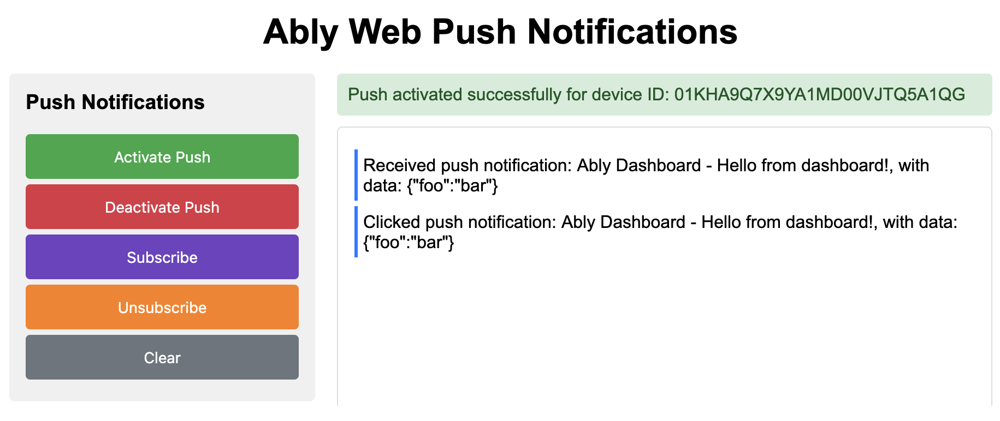

This guide will get you started with Ably Push Notifications in a web application using vanilla JavaScript and a service worker.

You'll learn how to set up an Ably Realtime client with push notification support, register a service worker, activate push notifications, subscribe to channel-based push, publish push notifications, and handle incoming notifications in both the service worker and main page.

<Aside data-type='note'>
Using an AI coding assistant? [Teach it Ably](/docs/platform/ai-llms#agent-skills) with Agent Skills for all popular AI coding agents. Run `claude plugin add ably/agent-skills` or `npx skills add ably/agent-skills` to get started.
</Aside>

## Prerequisites <a id="prerequisites"/>

1. [Sign up](https://ably.com/signup) for an Ably account.
2. Create a [new app](https://ably.com/accounts/any/apps/new), and create your first API key in the **API Keys** tab of the dashboard.
  * Your API key needs the `publish`, `subscribe` capabilities.
  * Also add the `push-admin` capability if you're using the same API key to publish a push notification. In production this would more likely be a server using a different API key.
3. Add a rule to a channel so you can test sending push notification via a channel. Select [**Rules**](https://ably.com/accounts/any/apps/any/app_namespaces) in the Ably dashboard, add a new rule and enable the **Push notifications** option.
4. A modern browser that supports the [Push API](https://developer.mozilla.org/en-US/docs/Web/API/Push_API) (Chrome, Firefox, or Edge recommended). Safari has limited Web Push support.
5. A local web server to serve your files over `http://localhost` (service workers require a secure context or localhost).

### (Optional) Install Ably CLI <a id="install-cli"/>

Use the [Ably CLI](/docs/platform/tools/cli) as an additional client to quickly test Pub/Sub features and push notifications.

[`ably init`](/docs/cli/init) installs the Ably CLI, authenticates, and sets the default app and API key in a single command:

<Code>
```shell
npx @ably/cli init
```
</Code>

### Serve your files locally <a id="serve-locally"/>

Service workers require files to be served from a web server (not opened directly as `file://`).
Navigate to your project directory and use one of the following methods to start a local server:

**Python (built-in on macOS):**

<Code fixed="true">
```shell
# Python 3
python3 -m http.server 8000
```
</Code>

**Node.js:**

<Code fixed="true">
```shell
# Install a simple HTTP server globally
npm install -g http-server

# Serve the current directory
http-server -p 8000
```
</Code>

**PHP:**

<Code fixed="true">
```shell
php -S localhost:8000
```
</Code>

Then open your browser at `http://localhost:8000`.

### Project structure <a id="project-structure"/>

Your project consists of two files:

- `index.html` — the main page with UI and Ably client logic.
- `service-worker.js` — the service worker that handles push events and notification clicks.

## Step 1: Set up Ably <a id="step-1"/>

This step initializes the Ably Realtime client with the necessary configuration for push notifications, including the API key, client ID, and service worker URL. It also sets up a subscription to the specified channel to listen for incoming messages and log them to the output div.

First, create the `index.html` file with the Ably SDK scripts and a HTML structure for logging messages and displaying status of operations:

<Code>
```html
<!DOCTYPE html>
<html lang="en">
<head>
    <meta charset="UTF-8">
    <title>Ably Web Push Notifications</title>
    <style>
    </style>
</head>
<body>
    <h1>Ably Web Push Notifications</h1>

    <div class="container">
        <div class="output-container">
            <div id="pushStatus" class="status"></div>
            <div id="output"></div>
        </div>
    </div>

    <script src="https://cdn.ably.com/lib/ably.min-2.js"></script>
    <script src="https://cdn.ably.com/lib/push.umd.min-2.js"></script>
    <script>
    </script>
</body>
</html>
```
</Code>

The two script tags load the Ably Realtime SDK and the Ably Push plugin respectively.

Now add this code inside the empty `<script>` tag to initialize the Ably client and subscribe to a realtime channel:

<Code>
```javascript
const channelName = 'my-first-push-channel';

let realtimeClient;
let channel;

// Initialize Ably connection
async function getStarted() {
    realtimeClient = new Ably.Realtime({
        key: '{{API_KEY}}', // Your Ably API key (do not use API key in production, use token authentication instead)
        clientId: 'push-tutorial-client',
        plugins: { Push: AblyPushPlugin },
        pushServiceWorkerUrl: '/service-worker.js'
    });

    await realtimeClient.connection.once('connected');
    log('Connected to Ably with clientId: ' + realtimeClient.clientId);

    channel = realtimeClient.channels.get(channelName);

    await channel.subscribe((message) => {
        let logMessage = 'Received message: ' + message.name;
        if (message.data) {
            logMessage += '<br>- data: ' + JSON.stringify(message.data);
        }
        if (message.extras && message.extras.push) {
            logMessage += '<br>- push: ' + message.extras.push.notification.title
                + ' - ' + message.extras.push.notification.body;
        }
        log(logMessage);
    });
}

// Log channel messages to the output div
function log(message) {
    output.innerHTML += '<p>' + message + '</p>';
    console.log(message);
    output.scrollTop = output.scrollHeight;
}

// Show status messages
function showStatus(message, type = 'success') {
    pushStatus.style.display = 'block';
    pushStatus.className = 'status ' + type;
    pushStatus.textContent = message;
}

// Clear output log
function clearOutput() {
    output.innerHTML = '';
}

// Initialize app
getStarted();
```
</Code>

Key configuration options:

- **`key`**: Your Ably API key.
- **`clientId`**: A unique identifier for this client.
- **`plugins`**: The `AblyPushPlugin` loaded from the separate push script.
- **`pushServiceWorkerUrl`**: The path to your service worker file relative to the root of your site.

There are also some helper functions to log messages to the output div, show status messages and clear the output log.

## Step 2: Set up push notifications <a id="step-2"/>

This step involves activating and deactivating push notifications. When activated, the browser will prompt the user for notification permissions and register the device with Ably.

<Aside data-type='note'>
The buttons referenced in these functions (`activatePushBtn` and `deactivatePushBtn`) are added to the HTML in [Step 4](#step-4). The code in this step won't be fully functional until that step is complete.
</Aside>

Add the following functions to your `<script>` tag:

<Code>
```javascript
// Activate push notifications
async function activatePush() {
    try {
        activatePushBtn.disabled = true;
        showStatus('Activating Ably push notifications...', 'progress');

        await realtimeClient.push.activate();

        activatePushBtn.disabled = false;
        showStatus('Push activated successfully for device ID: ' + realtimeClient.device().id);
        log('Push activated successfully for device ID: ' + realtimeClient.device().id);
    } catch (error) {
        console.error('Error activating push:', error);
        showStatus('Failed to activate push: ' + error.message, 'error');
        activatePushBtn.disabled = false;
    }
}

// Deactivate push notifications
async function deactivatePush() {
    try {
        deactivatePushBtn.disabled = true;
        showStatus('Deactivating push notifications...', 'progress');

        await realtimeClient.push.deactivate();

        showStatus('Push notifications deactivated.', 'success');
        deactivatePushBtn.disabled = false;
    } catch (error) {
        showStatus('Failed to deactivate push: ' + error.message, 'error');
        deactivatePushBtn.disabled = false;
    }
}
```
</Code>

When `realtimeClient.push.activate()` is called, the Ably SDK will:

1. Register the service worker specified in `pushServiceWorkerUrl`.
2. Request notification permission from the user (the browser will show a permission prompt).
3. Obtain a push subscription from the browser's Push API.
4. Register the device with Ably's push notification service.

After successful activation, `realtimeClient.device().id` contains the unique device ID assigned by Ably.

A service worker is a key part of the push notifications workflow for web browsers. It's a JavaScript file that runs in the background and can receive push notifications even when the page is not open. Create a `service-worker.js` file in the root of your project.

The service worker listens for `push` events and displays a notification using `self.registration.showNotification()`. It can also forward the notification data to any open pages via `client.postMessage()`:

<Code>
```javascript
// Handle push events
self.addEventListener("push", (event) => {
    const eventData = event.data.json();

    // Prepare the notification object suitable for both `showNotification` and `postMessage`
    const notification = {
        title: eventData.notification.title,
        body: eventData.notification.body,
        data: eventData.data
    };

    // Display a native browser notification
    self.registration.showNotification(notification.title, notification);

    // Also send to open pages (optional, for demonstration purposes)
    event.waitUntil(
        clients.matchAll({ type: 'window', includeUncontrolled: true }).then(function(clientList) {
            clientList.forEach(client => {
                client.postMessage({
                    type: 'tutorial-push',
                    notification: notification
                });
            });
        })
    );
});
```
</Code>

Add a `notificationclick` listener in the same `service-worker.js` to handle what happens when the user clicks the notification:

<Code>
```javascript
// Handle notification clicks
self.addEventListener('notificationclick', function(event) {
    event.notification.close();

    // Open or focus the app window
    event.waitUntil(
        clients.matchAll({ type: 'window', includeUncontrolled: true }).then(function(clientList) {
            const url = event.notification.data?.url || '/';

            // Check if there's already a window open
            for (let i = 0; i < clientList.length; i++) {
                const client = clientList[i];
                if (client.url === url || url === '/') {
                    client.postMessage({
                        type: 'tutorial-push-click',
                        notification: {
                            title: event.notification.title,
                            body: event.notification.body,
                            data: event.notification.data
                        }
                    });
                    if (client.focus) {
                        return client.focus();
                    }
                }
            }

            // Open a new window if none exists
            if (clients.openWindow) {
                return clients.openWindow(url);
            }
        })
    );
});
```
</Code>

When a notification is clicked, the handler closes the notification, looks for an existing window, sends it the notification data via `postMessage`, and focuses it. If no window exists, it opens a new one.

### Handle push notifications <a id="step-2-handle"/>

Back in your `index.html`, add a listener to receive messages from the service worker. This lets you update the page UI when a push notification is received or clicked. Add it anywhere in the `<script>` section (for example, before the `getStarted()` call):

<Code>
```javascript
// Listen for messages from the service worker about push notifications
navigator.serviceWorker.addEventListener('message', event => {
    const notification = event.data.notification;
    switch (event.data?.type) {
        case 'tutorial-push':
            log('Received push notification: ' + notification.title
                + ' - ' + notification.body
                + ', with data: ' + JSON.stringify(notification.data));
            break;
        case 'tutorial-push-click':
            log('Clicked push notification: ' + notification.title
                + ' - ' + notification.body
                + ', with data: ' + JSON.stringify(notification.data));
            break;
    }
});
```
</Code>

## Step 3: Subscribe to channel push notifications <a id="step-3"/>

To subscribe your device to a channel so it can receive channel-based push notifications, add the following functions to your `<script>` tag:

<Code>
```javascript
// Subscribe to push notifications on the channel
async function subscribeToChannel() {
    try {
        await channel.push.subscribeDevice();
        showStatus('Subscribed to push notifications on channel: ' + channelName);
    } catch (error) {
        showStatus('Failed to subscribe to channel push: ' + error.message, 'error');
        throw error;
    }
}

// Unsubscribe from push notifications on the channel
async function unsubscribeFromChannel() {
    try {
        await channel.push.unsubscribeDevice();
        showStatus('Unsubscribed from push notifications on channel: ' + channelName);
    } catch (error) {
        showStatus('Failed to unsubscribe from channel push: ' + error.message, 'error');
        throw error;
    }
}
```
</Code>

## Step 4: Build the UI <a id="step-4"/>

Add the following HTML structure to the `index.html` file before the `output-container` div:

<Code>
```html
<div class="controls">
    <h3>Push Notifications</h3>
    <button id="activatePushBtn">Activate Push</button>
    <button id="deactivatePushBtn">Deactivate Push</button>
    <button id="subscribeBtn">Subscribe</button>
    <button id="unsubscribeBtn">Unsubscribe</button>
    <button id="clearBtn">Clear</button>
</div>
```
</Code>

Then add the following to the `<script>` section. Place the button references after the channel name declaration, and the event listeners before the `getStarted()` call:

<Code>
```javascript
const activatePushBtn = document.getElementById('activatePushBtn');
const deactivatePushBtn = document.getElementById('deactivatePushBtn');
const subscribeBtn = document.getElementById('subscribeBtn');
const unsubscribeBtn = document.getElementById('unsubscribeBtn');
const clearBtn = document.getElementById('clearBtn');

activatePushBtn.addEventListener('click', activatePush);
deactivatePushBtn.addEventListener('click', deactivatePush);
subscribeBtn.addEventListener('click', subscribeToChannel);
unsubscribeBtn.addEventListener('click', unsubscribeFromChannel);
clearBtn.addEventListener('click', clearOutput);
```
</Code>

Finally, add the following CSS to the empty `<style>` section to make the UI look a bit nicer:

<Code>
```css
body {
    font-family: Arial, sans-serif;
    margin: 0;
    padding: 20px;
}
h1 {
    text-align: center;
    margin-bottom: 20px;
}
.container {
    display: flex;
    gap: 20px;
    max-width: 900px;
    margin: 0 auto;
}
.controls {
    flex: 0 0 250px;
    padding: 15px;
    background: #f0f0f0;
    border-radius: 5px;
    height: fit-content;
}
.controls h3 {
    margin-top: 0;
}
button {
    padding: 12px 20px;
    margin: 5px 0;
    cursor: pointer;
    background: #007bff;
    color: white;
    border: none;
    border-radius: 4px;
    width: 100%;
    display: block;
    font-size: 14px;
}
button:hover {
    background: #0056b3;
}
button:disabled {
    background: #ccc;
    cursor: not-allowed;
}
#activatePushBtn {
    background: #28a745;
}
#activatePushBtn:hover {
    background: #218838;
}
#deactivatePushBtn {
    background: #dc3545;
}
#deactivatePushBtn:hover {
    background: #c82333;
}
#unsubscribeBtn {
    background: #fd7e14;
}
#unsubscribeBtn:hover {
    background: #e96b00;
}
#subscribeBtn {
    background: #6f42c1;
}
#subscribeBtn:hover {
    background: #5a32a3;
}
#clearBtn {
    background: #6c757d;
}
#clearBtn:hover {
    background: #545b62;
}
.output-container {
    flex: 1;
}
#output {
    padding: 15px;
    border: 1px solid #ddd;
    border-radius: 5px;
    min-height: 500px;
    max-height: 70vh;
    overflow-y: auto;
    background: #fff;
}
#output p {
    margin: 5px 0;
    padding: 5px;
    background: #fff;
    border-left: 3px solid #007bff;
}
.status {
    padding: 10px;
    margin-bottom: 10px;
    border-radius: 4px;
}
.status.success { background: #d4edda; color: #155724; }
.status.error { background: #f8d7da; color: #721c24; }
.status.warning { background: #fff3cd; color: #856404; }
.status.progress { background: #e5e5e5; color: #454545; }
```
</Code>

Save all the files and open `http://localhost:8000` in your browser (you might want to clear the browser's cache if it's not your first time running the project). You will see the UI with buttons to activate push notifications and subscribe to the channel.

## Step 5: Publish a push notification <a id="step-5"/>

In the app click **Activate Push** and wait until the log message with the device ID is displayed.

### Publish directly to your device <a id="step-5-direct"/>

Publish a push notification directly to your client ID (or device ID using `--device-id` instead of `--client-id`) via the [Ably CLI](/docs/platform/tools/cli):

<Code fixed="true">
```shell
ably push publish --client-id push-tutorial-client \
  --title "Hello" \
  --body "World!" \
  --data '{"foo":"bar"}'
```
</Code>

### Publish via a channel <a id="step-5-channel"/>

Click **Subscribe** in the app, then publish a push notification to the channel using the [Ably CLI](/docs/platform/tools/cli):

<Code fixed="true">
```shell
ably push publish --channel my-first-push-channel \
  --title "Hello" \
  --body "World!" \
  --message '{"name":"greeting","data":"Hello World!"}'
```
</Code>

Here you can see the first push sent to the `deviceId`. And the second one published to the channel together with the realtime message:



If you click **Unsubscribe**, you will no longer receive push notifications for that channel. Run the same command again and verify that no notification is received.

To see the full list of options for publishing push notifications with the Ably CLI, run `ably push publish --help` or see the [Ably CLI push documentation](/docs/cli/push). To publish push notifications from your own server code instead of the CLI, see [Push notification publishing](https://ably.com/docs/push/publish).

## Browser compatibility <a id="browser-compatibility"/>

Web Push notification support varies across browsers:

| Feature | Chrome/Edge | Firefox | Safari |
|---|---|---|---|
| Push API | Full support | Full support | Partial (macOS 13+) |
| Service Worker | Full support | Full support | Full support |
| Notification actions (buttons) | Supported | Limited | Not supported |
| Silent push | Supported | Supported | Not supported |

<Aside data-type="note">
Safari on macOS 13+ supports Web Push, but with some limitations. Notification action buttons are not supported in Safari or Firefox on macOS.
</Aside>

## Next steps <a id="next-steps"/>

* Understand [token authentication](/docs/auth/token) before going to production.
* Explore [push notification administration](/docs/push#push-admin) for managing devices and subscriptions.
* Learn about [rules](/docs/channels#rules) for channel-based push notifications.
* Read more about the [Push Admin API](/docs/api/realtime-sdk/push-admin).
* Check out the [Web Push Notifications](/docs/push/configure/web) documentation for advanced use cases.
* Explore [Ably CLI push commands](/docs/cli/push) for the full list of push CLI options.

You can also explore the [Ably JavaScript SDK](https://github.com/ably/ably-js) on GitHub, or visit the [API references](/docs/api/realtime-sdk?lang=javascript) for additional functionality.
