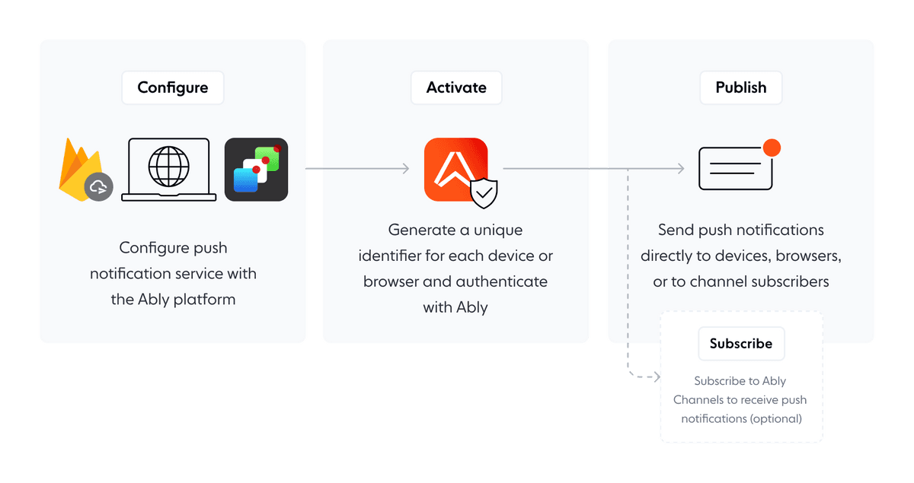
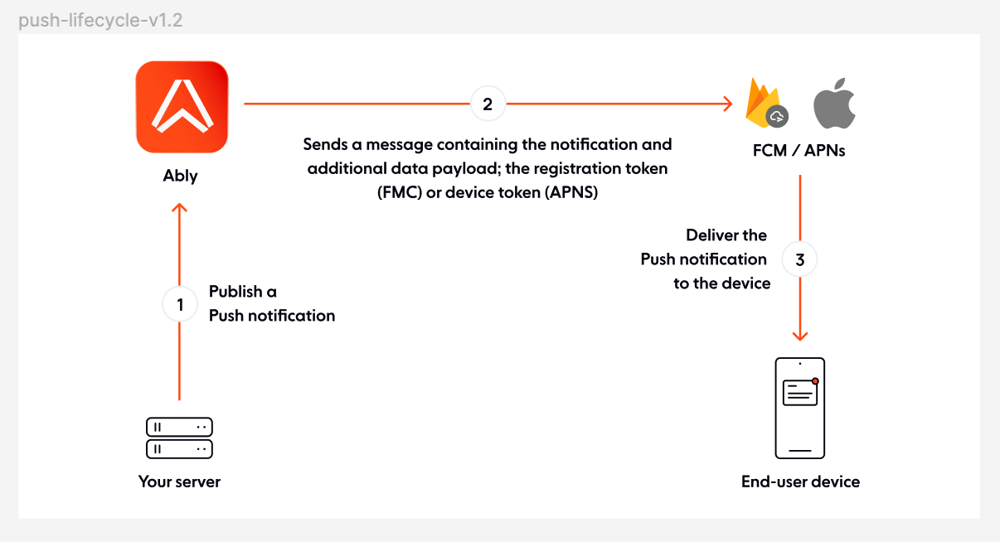

Push notifications notify user devices or browsers regardless of whether an application is open and running. They deliver information, such as app updates, social media alerts, or promotional offers, directly to the user's screen. Ably sends push notifications to devices using [Firebase Cloud Messaging](https://firebase.google.com/docs/cloud-messaging) or [Apple Push Notification Service](https://developer.apple.com/notifications/), and to browsers using [Web Push](https://developer.mozilla.org/en-US/docs/Web/API/Push_API). Push notifications don't require a device or browser to stay connected to Ably. Instead, a device's or browser's operating system or web browser maintains its own battery-efficient transport to receive notifications.

## Billing and connection considerations <a id="billing"/>

Push notifications have specific billing implications that differ from regular realtime connections:

- **Push subscriptions don't count as connections**: Devices registered for push notifications don't count toward your [concurrent connection](/docs/platform/pricing/limits#connection) limits when they're not actively connected to Ably.
- **Channel activation affects billing**: When you publish push notifications via channels, those channels become activated and count toward your concurrent (peak) channel count for billing purposes.
- **Multiple devices, one message count**: Publishing a single push notification to multiple devices via a channel counts as one outbound message per recipient device.

You can publish push notifications to user devices or browsers [directly](/docs/push/publish/#direct-publishing) or [via channels](#via-channels).

**Publishing directly** sends push notifications to specific devices or browsers identified by unique identifiers, such as a `deviceId` or a `clientId`. This approach is akin to sending a personal message or alerts directly to an individual user's device or browser, bypassing the need for channel subscriptions. It excels in targeted and personalized communications, such as alerts specific to a user's actions, account notifications, or customized updates.

**Publishing via channels** uses a [Pub/Sub](/docs/channels/messages) model. Messages are sent to channels to which multiple devices or browsers can subscribe. When a message is published to a channel, all devices or browsers subscribed to that channel receive the notification. This approach is particularly powerful for simultaneously publishing messages to multiple users.

## Push notification process

Integrating push notifications into your application includes a few essential configuration steps.

The following diagram demonstrates the push notification process:



### Configure

Configuring push notifications sets your [device's](/docs/push/configure/device) or [browser's](/docs/push/configure/web) push notification service to operate with the Ably [platform](https://ably.com/docs/). This process includes inputting the necessary credentials into your Ably [dashboard](https://ably.com/accounts).

### Activate

Activate devices or browsers for push notifications [directly](/docs/push/configure/device#device) or [via a server](/docs/push/configure/device#server):

* Activating **directly** enables devices or browsers to receive push notifications. This process involves obtaining a device or browser unique identifier, which serves as a push recipient. Direct activation is typically used when the application can directly handle device or browser registration without intermediaries, providing a straightforward approach to activation.

* Activating **via server** delegates the activation process to your server rather than handling it directly on devices or browsers. This approach is often preferred to minimize the capabilities assigned to untrusted devices or browsers, enhancing security and control. By managing device or browser registrations server-side, you can also centralize activation logistics and handle sensitive operations away from the client.

### Publish

Publish push notifications using Ably via [channels](/docs/push/publish#channel-pub) or [directly](/docs/push/publish#direct-publishing):

* Publishing directly allows for the delivery of push notifications straight to individual devices or browsers. This process is beneficial for targeting a specific device or browser using a unique [`deviceId`](/docs/push/publish#device-id), [`clientId`](/docs/push/publish#client-id), or [`recipient`](#recipient). Direct publishing is akin to sending a personal, targeted message to a user's device or browser.

* Publishing via channels operates similarly to Ably's [Pub/Sub](/docs/channels/messages) messaging model, broadcasting notifications to all channel subscribers. This process leverages Ably [channels](/docs/channels) to distribute push notifications efficiently to all devices or browsers subscribed to those channels. It is ideal for scenarios where the same information, such as alerts or updates, needs to be sent to multiple users.

#### Subscribe

If you publish via channels, devices or browsers must subscribe to those channels to receive notifications. This process offers flexibility in managing and delivering notifications. Subscriptions can be made using the `deviceId` or `clientId`:

* The [`deviceId`](/docs/push/publish#sub-deviceID) process subscribes devices or browsers directly to a channel using its unique `deviceId`, assigned by Ably, for push notifications upon device activation.

* The [`clientId`](/docs/push/publish#sub-clientID) process subscribes all devices or browsers tied to a particular `clientId` to a channel in one action, for example the same user's laptop and mobile phone. This approach is useful for subscribing multiple devices or browsers simultaneously.

## Push notification lifecycle <a id="lifecycle"/>

The following diagram shows the push notification lifecycle:



The following explains the push notification lifecycle:

* Publish a push notification:
  * The process begins with your app (client) or server, which publishes a push notification.
  * Your app or server sends the notification data to Ably.
* Handle push notification:
  * After receiving the push notification, Ably processes and packages the notification.
  * Ably then forwards the packaged message to the appropriate push notification service *FCM*, *APNs*, or Web Push.
* Deliver push notification:
  * The selected push notification service takes responsibility for delivering the notification to the target devices.
  * The push notification arrives at the end-user's devices or browsers, displaying the notification on their screen.

## Push admin API <a id="push-admin"/>

Ably's [push admin API](/docs/api/realtime-sdk/push-admin) is a set of functionalities designed for backend servers to manage push notification tasks. It handles registering devices or browsers for push notifications, managing subscriptions to specific channels, and sending push notifications directly to devices, browsers or users identified by a client identifier. It can be used with both the realtime and REST interfaces of an Ably SDK.

Using the push Admin API requires explicit capabilities within a client's credentials:

* Access using the [`push-admin`](/docs/api/realtime-sdk/push-admin#methods) capabilities grants full API access, enabling the management of registrations and subscriptions for all devices or browsers.

* Access using the [`push-subscribe`](/docs/api/realtime-sdk/push-admin#methods) capabilities designates a client as a push target device or browser. It can only manage its own registration and subscriptions, not those of other devices or browsers.

Each push target device or browser is associated with a unique `deviceId` and authentication credentials. Authentication can be achieved in two ways when using the push Admin API:

* By utilizing an Ably token containing the device's or browser's `deviceId`.

* By employing a standard [Ably key](/docs/auth/basic) or [Token](/docs/auth/token), with a `deviceIdentityToken`, a credential generated during registration to assert the device's or browser's identity, included in the request header.

The service credential management is handled by the [Ably SDK](https://ably.com/docs/sdks), removing the need for the client application to manage device credentials unless accessing the [push admin API](/docs/api/realtime-sdk/push-admin) directly via HTTP.

#### Error handling <a id="Error"/>

Metachannels, such as `[meta]log:push`, publish events and errors that aren't otherwise available to clients. It's important to note that client-returned errors will not be published to this channel.

The following example subscribes to the `[meta]log:push` channel:

<Code>
```javascript
const channel = realtime.channels.get('[meta]log:push');
channel.subscribe(msg => console.log(msg));
```
</Code>

## Troubleshooting push notifications <a id="troubleshooting"/>

If you're not receiving expected push notifications, follow these debugging steps:

### Verify device registration

Check if your device is registered in the Ably dashboard:
1. Go to Notifications tab → Device inspector
2. Search for your device using `deviceId` or `clientId`
3. Verify device state:
   - ACTIVE: Ready to receive notifications
   - FAILED: Check error details (common: registration expired, invalid token)

### Test delivery

Use the [push inspector](/docs/platform/account/app/notifications#push-inspector) in your dashboard to send test notifications directly to your device.

### Check for errors

Monitor the `[meta]log:push` channel for delivery errors. Common platform-specific issues:

APNs (iOS):
- BadDeviceToken: Environment mismatch (sandbox vs production)
- DeviceTokenNotForTopic: Bundle ID mismatch in certificate

FCM (Android):
- FcmTransport not configured: Invalid service account JSON
- 403 Forbidden: FCM API not enabled or permission issues
- 404 NOT_FOUND: Device unregistered (app uninstalled)

Web Push:
- Service worker registration failed: Conflicting VAPID keys from previous registrations

### Duplicate notifications

If you're receiving duplicate push notifications for the same device, this typically occurs when a device has both a `deviceId` and `clientId` subscription to the same channel:

- `deviceId` subscriptions deliver notifications to a single specific device.
- `clientId` subscriptions deliver notifications to all devices sharing that client ID.

If a device has both subscription types, it will receive the notification twice. To resolve:
1. Use the [push inspector widget](/docs/platform/account/app/notifications#push-inspector-widget) to check channel subscriptions.
2. Remove either the `deviceId` or `clientId` subscription for the affected device.

### Debug checklist

- Device shows as ACTIVE in dashboard.
- Push credentials configured correctly.
- Environment settings match (sandbox/production).
- App has notification permissions.
- No errors in `[meta]log:push` channel.
- Check for duplicate subscriptions (both `deviceId` and `clientId`).

For detailed troubleshooting steps, see the [push inspector documentation](/docs/platform/account/app/notifications#push-inspector) and [error logging](/docs/metadata-stats/metadata/subscribe#log).
