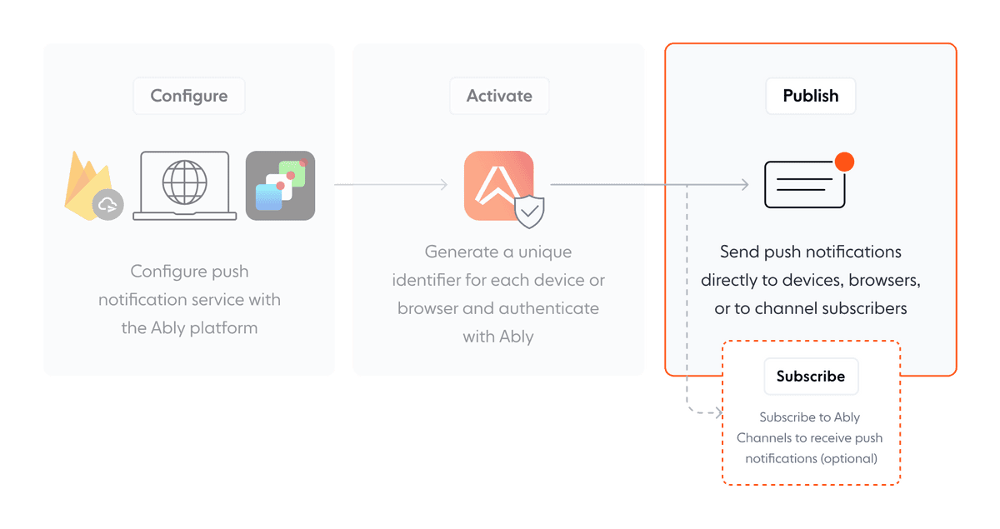

Publishing sends push notifications to all specified devices or browsers either directly or via channels. This process is facilitated by Ably's realtime messaging infrastructure, which ensures that messages and notifications are delivered instantaneously.



Publish push notifications directly or via channels:

- **[Publish directly](#direct-publishing)**:
  - **Description:** Messages are sent directly to specified devices or browsers without the need for channel subscriptions.
  - **Requirement:** Relies on [`deviceIds`](#device-id), [`clientIds`](#client-id) and [recipient attributes](#recipient) to target messages directly to devices or browsers.

- **[Publish via channels](#via-channels)**:
  - **Description:** Messages are sent to multiple devices or browsers through specified channels.
  - **Requirement:** Devices or browsers must be [subscribed](#sub-channels) to these channels to receive notifications.

## Push notification payload structure <a id="payload"/>

Ably adapts message fields for seamless compatibility with each push notification platform:

- **Ably field**: The message field in Ably.
- **FCM Field**: Field mapping in Firebase Cloud Messaging.
- **APNs**: Field mapping in Apple Push Notification service.
- **Web Push**: Field mapping in the Notification API.

The following table shows how the mapping works:

| **Ably field** | **FCM** | **APNs** | **Web Push** |
| --- | --- | --- | --- |
| `notification.title` | `notification.title` | `aps.alert.title` | `notification.title` |
| `notification.body` | `notification.body` | `aps.alert.body` | `notification.body` |
| `notification.icon` | `notification.icon` | Discarded | `notification.icon` |
| `notification.sound` | `notification.sound` | `aps.alert.sound` | Discarded |
| `notification.collapseKey` | `collapse_key` | `aps.thread-id` | Discarded |
| `data` | `data` | Merged into root object | `notification.data` |

The following examples show how Ably transforms each field:

<Code>
```json
{
  // General notification structure
  "notification": {
    "collapseKey": "chat"
  }
}

// Equivalent raw format for FCM
{
  "collapse_key": "chat"
}

// Equivalent raw format for APNs
{
  "aps.thread-id": "chat"
}
```
</Code>

You can also override generic values for a field or add specific fields not supported in the general structure. The following is an example of overriding the title for iOS and setting a specific background color for Android:

<Code>
```json
// Example payload structure with specific customizations for APNs and FCM
{
  "notification": {
    "title": "Hello from Ably!",
    "body": "Example push notification from Ably."
  },
  "data": {
    "foo": "bar",
    "baz": "qux"
  },
  "apns": {
    "aps": {
      "alert": {
        "title": "Hello to iOS from Ably!"
      }
    }
  },
  "fcm": {
    "notification": {
      "color": "#d3d3d3"
    }
  },
  "web": {
    "badge": "/badge.png"
  }
}
```
</Code>

### APNs Headers <a id="apns-headers"/>

To enable background notifications on iOS, you must include specific headers in the notification. You can specify these headers by adding an `apns-headers` object, which should contain all the desired APNs headers, as part of the `apns` object.

The following example shows a background notification:

<Code>
```json
{
  "data": {
    "foo": "bar",
    "baz": "qux"
  },
  "apns": {
    "aps": {
      "content-available": 1,
    },
    "apns-headers": {
      "apns-push-type": "background",
      "apns-priority": "5"
    }
  }
}
```
</Code>

## Publish directly <a id="direct-publishing"/>

Direct publishing sends push notifications directly to individual devices via the [Ably SDK](https://ably.com/docs/sdks), bypassing the intermediary of channels. This approach delivers personalized or precise notifications customized for individual users. Direct publishing proves beneficial during the transition phase to Ably's platform and when the objective is to engage existing push notification devices.

Direct publishing is also available in [batch mode](#via-batch-push-api), enabling you to publish to a large number of devices in one request.

Push notifications are targeted explicitly towards devices identified by:

* [`deviceId`](#device-id)
* [`clientId`](#client-id)
* [Recipient attributes](#recipient)

### Publish directly using `deviceId` <a id="device-id"/>

For applications requiring direct targeting of individual devices or browsers, using the `deviceId` allows for precise control over where each push notification is sent. This approach is ideal when notifications are intended for a specific device or browser, such as alerting users about actions required on a particular device or browser or sending device-specific or server-specific updates.

A `deviceId` is set during the device or browser [activation](device#device) process.

The following example publishes a push notification using the `deviceId`:

<Code>
```realtime_javascript
var recipient = {
  deviceId: 'xxxxxxxxxxx'
};

var data = {
  notification: {
    title: 'Hello from Ably!',
    body: 'Example push notification from Ably.',
    ttl: 3600 // Required for Web Push on some platforms and browsers like Microsoft Edge (WNS)
  }
};

realtime.push.admin.publish(recipient, data);
```

```realtime_nodejs
var recipient = {
  deviceId: 'xxxxxxxxxxx'
};

var data = {
  notification: {
    title: 'Hello from Ably!',
    body: 'Example push notification from Ably.',
    ttl: 3600 // Required for Web Push on some platforms and browsers like Microsoft Edge (WNS)
  }
};

realtime.push.admin.publish(recipient, data);
```

```realtime_ruby
recipient = {
  deviceId: 'xxxxxxxxxxx'
}

data = {
  notification: {
    title: 'Hello from Ably!',
    body: 'Example push notification from Ably.',
    ttl: 3600 # Required for Web Push on some platforms and browsers like Microsoft Edge (WNS)
  }
}

realtime.push.admin.publish(recipient, data)
```

```realtime_java
JsonObject payload = JsonUtils.object()
    .add("notification", JsonUtils.object()
        .add("title", "Hello from Ably!")
        .add("body", "Example push notification from Ably.")
        .add("ttl", 3600) // Required for Web Push on some platforms and browsers like Microsoft Edge (WNS)
    )
    .toJson();

realtime.push.admin.publish(
    new Param[] { new Param("deviceId", "xxxxxxxxxxxx") },
    payload
);
```

```realtime_python
recipient = {
    'deviceId': 'xxxxxxxxxxxx'
}

message = {
    'notification': {
        'title': 'Hello from Ably!',
        'body': 'Example push notification from Ably.',
        'ttl': 3600  # Required for Web Push on some platforms and browsers like Microsoft Edge (WNS)
    }
}

realtime.push.admin.publish(recipient, message)
```

```realtime_swift
let recipient = ["deviceId": "xxxxxxxxxxx"]

let data = [
    "notification": [
        "title": "Hello from Ably!",
        "body": "Example push notification from Ably.",
        "ttl": 3600 // Required for Web Push on some platforms and browsers like Microsoft Edge (WNS)
    ]
] as [String: Any]

realtime.push.admin.publish(recipient, data) { error in
    if let error = error {
        print("Error publishing: \(error)")
    }
}
```

```realtime_objc
NSDictionary *recipient = @{@"deviceId": @"xxxxxxxxxxx"};

NSDictionary *data = @{
    @"notification": @{
        @"title": @"Hello from Ably!",
        @"body": @"Example push notification from Ably.",
        @"ttl": @3600 // Required for Web Push on some platforms and browsers like Microsoft Edge (WNS)
    }
};

[realtime.push.admin publish:recipient data:data callback:^(ARTErrorInfo *error) {
    if (error) {
        NSLog(@"Error publishing: %@", error);
    }
}];
```

```realtime_csharp
var recipient = new JObject
{
    { "deviceId", "xxxxxxxxxxx" }
};

var data = new JObject
{
    ["notification"] = new JObject
    {
        { "title", "Hello from Ably!" },
        { "body", "Example push notification from Ably." },
        { "ttl", 3600 } // Required for Web Push on some platforms and browsers like Microsoft Edge (WNS)
    }
};

await ablyRealtime.Push.Admin.PublishAsync(recipient, data);
```

```rest_javascript
var recipient = {
  deviceId: 'xxxxxxxxxxx'
};

var data = {
  notification: {
    title: 'Hello from Ably!',
    body: 'Example push notification from Ably.',
    ttl: 3600 // Required for Web Push on some platforms and browsers like Microsoft Edge (WNS)
  }
};

rest.push.admin.publish(recipient, data);
```

```rest_nodejs
var recipient = {
  deviceId: 'xxxxxxxxxxx'
};

var data = {
  notification: {
    title: 'Hello from Ably!',
    body: 'Example push notification from Ably.',
    ttl: 3600 // Required for Web Push on some platforms and browsers like Microsoft Edge (WNS)
  }
};

rest.push.admin.publish(recipient, data);
```

```rest_ruby
recipient = {
  deviceId: 'xxxxxxxxxxx'
}

data = {
  notification: {
    title: 'Hello from Ably!',
    body: 'Example push notification from Ably.',
    ttl: 3600 # Required for Web Push on some platforms and browsers like Microsoft Edge (WNS)
  }
}

rest.push.admin.publish(recipient, data)
```

```rest_java
JsonObject payload = JsonUtils.object()
    .add("notification", JsonUtils.object()
        .add("title", "Hello from Ably!")
        .add("body", "Example push notification from Ably.")
        .add("ttl", 3600) // Required for Web Push on some platforms and browsers like Microsoft Edge (WNS)
    )
    .toJson();

rest.push.admin.publish(
    new Param[] { new Param("deviceId", "xxxxxxxxxxxx") },
    payload
);
```

```rest_python
recipient = {
    'deviceId': 'xxxxxxxxxxxx'
}

message = {
    'notification': {
        'title': 'Hello from Ably!',
        'body': 'Example push notification from Ably.',
        'ttl': 3600  # Required for Web Push on some platforms and browsers like Microsoft Edge (WNS)
    }
}

rest.push.admin.publish(recipient, message)
```

```rest_swift
let recipient = ["deviceId": "xxxxxxxxxxx"]

let data = [
    "notification": [
        "title": "Hello from Ably!",
        "body": "Example push notification from Ably.",
        "ttl": 3600 // Required for Web Push on some platforms and browsers like Microsoft Edge (WNS)
    ]
] as [String: Any]

rest.push.admin.publish(recipient, data) { error in
    if let error = error {
        print("Error publishing: \(error)")
    }
}
```

```rest_objc
NSDictionary *recipient = @{@"deviceId": @"xxxxxxxxxxx"};

NSDictionary *data = @{
    @"notification": @{
        @"title": @"Hello from Ably!",
        @"body": @"Example push notification from Ably.",
        @"ttl": @3600 // Required for Web Push on some platforms and browsers like Microsoft Edge (WNS)
    }
};

[rest.push.admin publish:recipient data:data callback:^(ARTErrorInfo *error) {
    if (error) {
        NSLog(@"Error publishing: %@", error);
    }
}];
```

```rest_php
$recipient = [
    'deviceId' => 'xxxxxxxxxxxx'
];

$data = [
    'notification' => [
        'title' => 'Hello from Ably!',
        'body' => 'Example push notification from Ably.',
        'ttl' => 3600 // Required for Web Push on some platforms and browsers like Microsoft Edge (WNS)
    ]
];

$rest->push->admin->publish($recipient, $data);

$channel = $rest->channels->get('pushenabled:foo');
$channel->publish(['name' => 'example', 'data' => 'data', 'extras' => $extras]);
```

```rest_csharp
var recipient = new JObject
{
    { "deviceId", "xxxxxxxxxxx" }
};

var data = new JObject
{
    ["notification"] = new JObject
    {
        { "title", "Hello from Ably!" },
        { "body", "Example push notification from Ably." },
        { "ttl", 3600 } // Required for Web Push on some platforms and browsers like Microsoft Edge (WNS)
    }
};

await ablyRest.Push.Admin.PublishAsync(recipient, data);
```
</Code>

### Publish directly using `clientId` <a id="client-id"/>

When you need to deliver push notifications to a specific user rather than a single device, you can use the `clientId` to target all devices associated with a particular user. This process is particularly useful for applications where users may have multiple devices or browsers, and you want to ensure that all devices or browsers receive the notifications seamlessly.

A `clientId` is set during the device or browser [activation](device#device) process.

The following example publishes a push notification using the `clientId`:

<Code>
```realtime_javascript
var recipient = {
  clientId: 'xxxxxxxxxxxx'
};

var notification = {
  notification: {
    title: 'Hello from Ably!',
    body: 'Example push notification from Ably.',
    ttl: 3600 // Required for Web Push on some platforms and browsers like Microsoft Edge (WNS)
  }
};

realtime.push.admin.publish(recipient, notification);
```

```realtime_nodejs
var recipient = {
  clientId: 'xxxxxxxxxxxx'
};

var notification = {
  notification: {
    title: 'Hello from Ably!',
    body: 'Example push notification from Ably.',
    ttl: 3600 // Required for Web Push on some platforms and browsers like Microsoft Edge (WNS)
  }
};

realtime.push.admin.publish(recipient, notification);
```

```realtime_ruby
recipient = {
  clientId: 'xxxxxxxxxxxx'
}

notification = {
  notification: {
    title: 'Hello from Ably!',
    body: 'Example push notification from Ably.',
    ttl: 3600 # Required for Web Push on some platforms and browsers like Microsoft Edge (WNS)
  }
}

realtime.push.admin.publish(recipient, notification)
```

```realtime_java
JsonObject payload = JsonUtils.object()
    .add("notification", JsonUtils.object()
        .add("title", "Hello from Ably!")
        .add("body", "Example push notification from Ably.")
        .add("ttl", 3600) // Required for Web Push on some platforms and browsers like Microsoft Edge (WNS)
    )
    .toJson();

realtime.push.admin.publish(new Param[]{new Param("clientId", "xxxxxxxxxxxx")}, payload);
```

```realtime_python
recipient = {
    'clientId': 'xxxxxxxxxxxx'
}

message = {
    'notification': {
        'title': 'Hello from Ably!',
        'body': 'Example push notification from Ably.',
        'ttl': 3600  # Required for Web Push on some platforms and browsers like Microsoft Edge (WNS)
    }
}

realtime.push.admin.publish(recipient, message)
```

```realtime_swift
let recipient = ["clientId": "xxxxxxxxxxxx"]

let notification = [
    "notification": [
        "title": "Hello from Ably!",
        "body": "Example push notification from Ably.",
        "ttl": 3600 // Required for Web Push on some platforms and browsers like Microsoft Edge (WNS)
    ]
] as [String: Any]

realtime.push.admin.publish(recipient, notification) { error in
    if let error = error {
        print("Error publishing: \(error)")
    }
}
```

```realtime_objc
NSDictionary *recipient = @{@"clientId": @"xxxxxxxxxxxx"};

NSDictionary *notification = @{
    @"notification": @{
        @"title": @"Hello from Ably!",
        @"body": @"Example push notification from Ably.",
        @"ttl": @3600 // Required for Web Push on some platforms and browsers like Microsoft Edge (WNS)
    }
};

[realtime.push.admin publish:recipient data:notification callback:^(ARTErrorInfo *error) {
    if (error) {
        NSLog(@"Error publishing: %@", error);
    }
}];
```

```realtime_csharp
var recipient = new { clientId = "xxxxxxxxxxxx" };

var notification = new
{
    notification = new
    {
        title = "Hello from Ably!",
        body = "Example push notification from Ably.",
        ttl = 3600 // Required for Web Push on some platforms and browsers like Microsoft Edge (WNS)
    }
};

realtime.Push.Admin.Publish(recipient, notification);
```

```rest_javascript
var recipient = {
  clientId: 'xxxxxxxxxxxx'
};

var notification = {
  notification: {
    title: 'Hello from Ably!',
    body: 'Example push notification from Ably.',
    ttl: 3600 // Required for Web Push on some platforms and browsers like Microsoft Edge (WNS)
  }
};

rest.push.admin.publish(recipient, notification);
```

```rest_nodejs
var recipient = {
  clientId: 'xxxxxxxxxxxx'
};

var notification = {
  notification: {
    title: 'Hello from Ably!',
    body: 'Example push notification from Ably.',
    ttl: 3600 // Required for Web Push on some platforms and browsers like Microsoft Edge (WNS)
  }
};

rest.push.admin.publish(recipient, notification);
```

```rest_ruby
recipient = {
  clientId: 'xxxxxxxxxxxx'
}

notification = {
  notification: {
    title: 'Hello from Ably!',
    body: 'Example push notification from Ably.',
    ttl: 3600 # Required for Web Push on some platforms and browsers like Microsoft Edge (WNS)
  }
}

rest.push.admin.publish(recipient, notification)
```

```rest_java
JsonObject payload = JsonUtils.object()
    .add("notification", JsonUtils.object()
        .add("title", "Hello from Ably!")
        .add("body", "Example push notification from Ably.")
        .add("ttl", 3600) // Required for Web Push on some platforms and browsers like Microsoft Edge (WNS)
    )
    .toJson();

rest.push.admin.publish(new Param[]{new Param("clientId", "xxxxxxxxxxxx")}, payload);
```

```python
recipient = {
    'clientId': 'xxxxxxxxxxxx'
}

message = {
    'notification': {
        'title': 'Hello from Ably!',
        'body': 'Example push notification from Ably.',
        'ttl': 3600  # Required for Web Push on some platforms and browsers like Microsoft Edge (WNS)
    }
}

rest.push.admin.publish(recipient, message)
```

```rest_swift
let recipient = ["clientId": "xxxxxxxxxxxx"]

let notification = [
    "notification": [
        "title": "Hello from Ably!",
        "body": "Example push notification from Ably.",
        "ttl": 3600 // Required for Web Push on some platforms and browsers like Microsoft Edge (WNS)
    ]
] as [String: Any]

rest.push.admin.publish(recipient, notification) { error in
    if let error = error {
        print("Error publishing: \(error)")
    }
}
```

```rest_objc
NSDictionary *recipient = @{@"clientId": @"xxxxxxxxxxxx"};

NSDictionary *notification = @{
    @"notification": @{
        @"title": @"Hello from Ably!",
        @"body": @"Example push notification from Ably.",
        @"ttl": @3600 // Required for Web Push on some platforms and browsers like Microsoft Edge (WNS)
    }
};

[rest.push.admin publish:recipient data:notification callback:^(ARTErrorInfo *error) {
    if (error) {
        NSLog(@"Error publishing: %@", error);
    }
}];
```

```rest_php
$recipient = [
    'clientId' => 'xxxxxxxxxxxx'
];

$data = [
    'notification' => [
        'title' => 'Hello from Ably!',
        'body' => 'Example push notification from Ably.',
        'ttl' => 3600 // Required for Web Push on some platforms and browsers like Microsoft Edge (WNS)
    ]
];

$rest->push->admin->publish($recipient, $data);

$channel = $rest->channels->get('pushenabled:foo');
$channel->publish(['name' => 'example', 'data' => 'data', 'extras' => $extras]);
```

```rest_csharp
var recipient = new { clientId = "xxxxxxxxxxxx" };

var notification = new
{
    notification = new
    {
        title = "Hello from Ably!",
        body = "Example push notification from Ably.",
        ttl = 3600 // Required for Web Push on some platforms and browsers like Microsoft Edge (WNS)
    }
};

rest.Push.Admin.Publish(recipient, notification);
```
</Code>

### Publish directly using recipient attributes <a id="recipient"/>

Direct publishing using recipient attributes allows for a highly tailored approach to sending notifications based on specific criteria such as device tokens or transport types. This method is particularly effective when engaging users across different platforms or devices with customized messages.

Recipient attributes are set during the device or browser [activation](device#device) process.

The following example publishes a push notification using the recipient attributes:

<Code>
```realtime_javascript
var recipient = {
  transportType: 'apns',
  deviceToken: 'xxxxxxxxxx'
};

var notification = {
  notification: {
    title: 'Hello from Ably!',
    body: 'Example push notification from Ably.',
    ttl: 3600 // Required for Web Push on some platforms and browsers like Microsoft Edge (WNS)
  }
};

realtime.push.admin.publish(recipient, notification);
```

```realtime_nodejs
var recipient = {
  transportType: 'apns',
  deviceToken: 'xxxxxxxxxx'
};

var notification = {
  notification: {
    title: 'Hello from Ably!',
    body: 'Example push notification from Ably.',
    ttl: 3600 // Required for Web Push on some platforms and browsers like Microsoft Edge (WNS)
  }
};

realtime.push.admin.publish(recipient, notification);
```

```realtime_ruby
recipient = {
  transport_type: 'apns',
  device_token: 'xxxxxxxxxx'
}

notification = {
  notification: {
    title: 'Hello from Ably!',
    body: 'Example push notification from Ably.',
    ttl: 3600 # Required for Web Push on some platforms and browsers like Microsoft Edge (WNS)
  }
}

realtime.push.admin.publish(recipient, notification)
```

```realtime_java
Message message = new Message("example", "rest data");
message.extras = io.ably.lib.util.JsonUtils.object()
    .add("notification", io.ably.lib.util.JsonUtils.object()
        .add("title", "Hello from Ably!")
        .add("body", "Example push notification from Ably.")
        .add("ttl", 3600)); // Required for Web Push on some platforms and browsers like Microsoft Edge (WNS)

realtime.push.admin.publish(
    new Param[] {
        new Param("transportType", "apns"),
        new Param("deviceToken", deviceToken)
    },
    message
);
```

```realtime_python
recipient = {
    'transportType': 'apns',
    'deviceToken': 'XXXXXXX'
}

message = {
    'notification': {
        'title': 'Hello from Ably!',
        'body': 'Example push notification from Ably.',
        'ttl': 3600  # Required for Web Push on some platforms and browsers like Microsoft Edge (WNS)
    }
}

realtime.push.admin.publish(recipient, message)
```

```realtime_swift
let recipient = [
    "transportType": "apns",
    "deviceToken": "xxxxxxxxxx"
] as [String: Any]

let notification = [
    "notification": [
        "title": "Hello from Ably!",
        "body": "Example push notification from Ably.",
        "ttl": 3600 // Required for Web Push on some platforms and browsers like Microsoft Edge (WNS)
    ]
] as [String: Any]

realtime.push.admin.publish(recipient, notification) { error in
    if let error = error {
        print("Error publishing: \(error)")
    }
}
```

```realtime_objc
NSDictionary *recipient = @{
    @"transportType": @"apns",
    @"deviceToken": @"xxxxxxxxxx"
};

NSDictionary *notification = @{
    @"notification": @{
        @"title": @"Hello from Ably!",
        @"body": @"Example push notification from Ably.",
        @"ttl": @3600 // Required for Web Push on some platforms and browsers like Microsoft Edge (WNS)
    }
};

[realtime.push.admin publish:recipient data:notification callback:^(ARTErrorInfo *error) {
    if (error) {
        NSLog(@"Error publishing: %@", error);
    }
}];
```

```realtime_csharp
var recipient = new { transport_type = "apns", deviceToken = "XXXXXXXXXX" };

var notification = new
{
    notification = new
    {
        title = "Hello from Ably!",
        body = "Example push notification from Ably.",
        ttl = 3600 // Required for Web Push on some platforms and browsers like Microsoft Edge (WNS)
    }
};

realtime.Push.Admin.Publish(recipient, notification);
```

```rest_javascript
var recipient = {
  transportType: 'apns',
  deviceToken: 'xxxxxxxxxx'
};

var notification = {
  notification: {
    title: 'Hello from Ably!',
    body: 'Example push notification from Ably.',
    ttl: 3600 // Required for Web Push on some platforms and browsers like Microsoft Edge (WNS)
  }
};

rest.push.admin.publish(recipient, notification);
```

```rest_nodejs
var recipient = {
  transportType: 'apns',
  deviceToken: 'xxxxxxxxxx'
};

var notification = {
  notification: {
    title: 'Hello from Ably!',
    body: 'Example push notification from Ably.',
    ttl: 3600 // Required for Web Push on some platforms and browsers like Microsoft Edge (WNS)
  }
};

rest.push.admin.publish(recipient, notification);
```

```rest_ruby
recipient = {
  transport_type: 'apns',
  device_token: 'xxxxxxxxxx'
}

notification = {
  notification: {
    title: 'Hello from Ably!',
    body: 'Example push notification from Ably.',
    ttl: 3600 # Required for Web Push on some platforms and browsers like Microsoft Edge (WNS)
  }
}

rest.push.admin.publish(recipient, notification)
```

```rest_java
Message message = new Message("example", "rest data");
message.extras = io.ably.lib.util.JsonUtils.object()
    .add("notification", io.ably.lib.util.JsonUtils.object()
        .add("title", "Hello from Ably!")
        .add("body", "Example push notification from Ably.")
        .add("ttl", 3600)); // Required for Web Push on some platforms and browsers like Microsoft Edge (WNS)

rest.push.admin.publish(
    new Param[] {
        new Param("transportType", "apns"),
        new Param("deviceToken", deviceToken)
    },
    message
);
```

```rest_python
recipient = {
    'transportType': 'apns',
    'deviceToken': 'XXXXXXX'
}

message = {
    'notification': {
        'title': 'Hello from Ably!',
        'body': 'Example push notification from Ably.',
        'ttl': 3600  # Required for Web Push on some platforms and browsers like Microsoft Edge (WNS)
    }
}

rest.push.admin.publish(recipient, message)
```

```rest_swift
let recipient = [
    "transportType": "apns",
    "deviceToken": "xxxxxxxxxx"
] as [String: Any]

let notification = [
    "notification": [
        "title": "Hello from Ably!",
        "body": "Example push notification from Ably.",
        "ttl": 3600 // Required for Web Push on some platforms and browsers like Microsoft Edge (WNS)
    ]
] as [String: Any]

rest.push.admin.publish(recipient, notification) { error in
    if let error = error {
        print("Error publishing: \(error)")
    }
}
```

```rest_objc
NSDictionary *recipient = @{
    @"transportType": @"apns",
    @"deviceToken": @"xxxxxxxxxx"
};

NSDictionary *notification = @{
    @"notification": @{
        @"title": @"Hello from Ably!",
        @"body": @"Example push notification from Ably.",
        @"ttl": @3600 // Required for Web Push on some platforms and browsers like Microsoft Edge (WNS)
    }
};

[rest.push.admin publish:recipient data:notification callback:^(ARTErrorInfo *error) {
    if (error) {
        NSLog(@"Error publishing: %@", error);
    }
}];
```

```rest_php
$recipient = [
    'transportType' => 'apns',
    'deviceToken' => 'XXXXXXX'
];

$data = [
    'notification' => [
        'title' => 'Hello from Ably!',
        'body' => 'Example push notification from Ably.',
        'ttl' => 3600 // Required for Web Push on some platforms and browsers like Microsoft Edge (WNS)
    ]
];

$rest->push->admin->publish($recipient, $data);
```

```rest_csharp
var recipient = new { transport_type = "apns", deviceToken = "XXXXXXXXXX" };

var notification = new
{
    notification = new
    {
        title = "Hello from Ably!",
        body = "Example push notification from Ably.",
        ttl = 3600 // Required for Web Push on some platforms and browsers like Microsoft Edge (WNS)
    }
};

rest.Push.Admin.Publish(recipient, notification);
```
</Code>

### Publish via batch push API <a id="via-batch-push-api"/>

The batch push API enables you to publish push notifications to multiple devices or browsers in a single request.

This is useful when you need to send a large number of distinct push notifications to multiple recipients. If you are publishing the same notification to multiple recipients, prefer publishing [via channels](#via-channels).

The batch push endpoint accepts a JSON array of `PushPublishSpec` objects, each of which contain a `recipient` or array of recipients, and a `payload`, where `payload` is the same as the payload you would use in a normal direct publish request.

Currently, the batch push endpoint allows a maximum of 10,000 notifications per request (each recipient for a given payload counts as a separate notification).

The following example shows how to publish multiple push notifications in one request using the batch API with the generic REST [`request()`](/docs/api/rest-sdk#request) method:

<Code>
```rest_javascript
await rest.request('POST', '/push/batch/publish', 3, null, [
  {
    recipient: {
      deviceId: 'xxxxxxxxxxx'
    },
    payload: {
      notification: { title: 'Message 1', body: 'Example push notification from Ably.' }
    }
  },
  {
    recipient: [
      {
        deviceId: 'xxxxxxxxxxx'
      },
      {
        deviceId: 'xxxxxxxxxxx',
      }
    ],
    payload: {
      notification: { title: 'Message 2', body: 'Example push notification from Ably.' }
    }
  }
])
```

```rest_nodejs
await rest.request('POST', '/push/batch/publish', 3, null, [
  {
    recipient: {
      deviceId: 'xxxxxxxxxxx'
    },
    payload: {
      notification: { title: 'Message 1', body: 'Example push notification from Ably.' }
    }
  },
  {
    recipient: [
      {
        deviceId: 'xxxxxxxxxxx'
      },
      {
        deviceId: 'xxxxxxxxxxx',
      }
    ],
    payload: {
      notification: { title: 'Message 2', body: 'Example push notification from Ably.' }
    }
  }
])
```

```rest_java
List<Object> batchRequests = Arrays.asList(
    JsonUtils.object()
        .add("recipient", JsonUtils.object().add("deviceId", "xxxxxxxxxxx"))
        .add("payload", JsonUtils.object()
            .add("notification", JsonUtils.object()
                .add("title", "Message 1")
                .add("body", "Example push notification from Ably.")
            )
        ).toJson(),
    JsonUtils.object()
        .add("recipient", Arrays.asList(
            JsonUtils.object().add("deviceId", "xxxxxxxxxxx").toJson(),
            JsonUtils.object().add("deviceId", "xxxxxxxxxxx").toJson()
        ))
        .add("payload", JsonUtils.object()
            .add("notification", JsonUtils.object()
                .add("title", "Message 2")
                .add("body", "Example push notification from Ably.")
            )
        ).toJson()
);

rest.request("POST", "/push/batch/publish", null, null, batchRequests);
```

```rest_ruby
batch_requests = [
  {
    recipient: {
      deviceId: 'xxxxxxxxxxx'
    },
    payload: {
      notification: { title: 'Message 1', body: 'Example push notification from Ably.' }
    }
  },
  {
    recipient: [
      {
        deviceId: 'xxxxxxxxxxx'
      },
      {
        deviceId: 'xxxxxxxxxxx'
      }
    ],
    payload: {
      notification: { title: 'Message 2', body: 'Example push notification from Ably.' }
    }
  }
]

rest.request('POST', '/push/batch/publish', {}, batch_requests)
```

```rest_python
batch_requests = [
    {
        'recipient': {
            'deviceId': 'xxxxxxxxxxx'
        },
        'payload': {
            'notification': {'title': 'Message 1', 'body': 'Example push notification from Ably.'}
        }
    },
    {
        'recipient': [
            {
                'deviceId': 'xxxxxxxxxxx'
            },
            {
                'deviceId': 'xxxxxxxxxxx'
            }
        ],
        'payload': {
            'notification': {'title': 'Message 2', 'body': 'Example push notification from Ably.'}
        }
    }
]

rest.request('POST', '/push/batch/publish', version=3, params=None, body=batch_requests)
```

```rest_swift
let batchRequests: [[String: Any]] = [
    [
        "recipient": [
            "deviceId": "xxxxxxxxxxx"
        ],
        "payload": [
            "notification": ["title": "Message 1", "body": "Example push notification from Ably."]
        ]
    ],
    [
        "recipient": [
            [
                "deviceId": "xxxxxxxxxxx"
            ],
            [
                "deviceId": "xxxxxxxxxxx"
            ]
        ],
        "payload": [
            "notification": ["title": "Message 2", "body": "Example push notification from Ably."]
        ]
    ]
]

rest.request("POST", path: "/push/batch/publish", params: nil, body: batchRequests) { result in
    // Handle result
}
```

```rest_objc
NSArray *batchRequests = @[
    @{
        @"recipient": @{
            @"deviceId": @"xxxxxxxxxxx"
        },
        @"payload": @{
            @"notification": @{@"title": @"Message 1", @"body": @"Example push notification from Ably."}
        }
    },
    @{
        @"recipient": @[
            @{@"deviceId": @"xxxxxxxxxxx"},
            @{@"deviceId": @"xxxxxxxxxxx"}
        ],
        @"payload": @{
            @"notification": @{@"title": @"Message 2", @"body": @"Example push notification from Ably."}
        }
    }
];

[rest request:@"POST" path:@"/push/batch/publish" params:nil body:batchRequests callback:^(ARTHTTPPaginatedResponse *result, ARTErrorInfo *error) {
    // Handle result
}];
```

```rest_csharp
var batchRequests = new object[]
{
    new {
        recipient = new { deviceId = "xxxxxxxxxxx" },
        payload = new {
            notification = new { title = "Message 1", body = "Example push notification from Ably." }
        }
    },
    new {
        recipient = new object[] {
            new { deviceId = "xxxxxxxxxxx" },
            new { deviceId = "xxxxxxxxxxx" }
        },
        payload = new {
            notification = new { title = "Message 2", body = "Example push notification from Ably." }
        }
    }
};

await rest.RequestAsync(HttpMethod.Post, "/push/batch/publish", null, batchRequests, null);
```

```rest_php
$batchRequests = [
    [
        'recipient' => [
            'deviceId' => 'xxxxxxxxxxx'
        ],
        'payload' => [
            'notification' => ['title' => 'Message 1', 'body' => 'Example push notification from Ably.']
        ]
    ],
    [
        'recipient' => [
            [
                'deviceId' => 'xxxxxxxxxxx'
            ],
            [
                'deviceId' => 'xxxxxxxxxxx'
            ]
        ],
        'payload' => [
            'notification' => ['title' => 'Message 2', 'body' => 'Example push notification from Ably.']
        ]
    ]
];

$rest->request('POST', '/push/batch/publish', 3, null, $batchRequests);
```

```rest_flutter
final batchRequests = [
  {
    'recipient': {
      'deviceId': 'xxxxxxxxxxx'
    },
    'payload': {
      'notification': {'title': 'Message 1', 'body': 'Example push notification from Ably.'}
    }
  },
  {
    'recipient': [
      {
        'deviceId': 'xxxxxxxxxxx'
      },
      {
        'deviceId': 'xxxxxxxxxxx'
      }
    ],
    'payload': {
      'notification': {'title': 'Message 2', 'body': 'Example push notification from Ably.'}
    }
  }
];

await rest.request('POST', '/push/batch/publish', 3, null, batchRequests);
```
</Code>

## Publish via channels <a id="via-channels"/>

Publishing via channels is modeled on Ably's [channel](#channels) infrastructure, facilitating the delivery of push notifications across a network of subscribed devices or browsers. This process publishes messages through predefined channels, which devices or browsers must [subscribe](#sub-channels) to in order to receive updates. This process ensures registered devices or browsers in the specified channels receive the correct push notifications. Publishing via channels is particularly useful for publishing notifications to multiple groups with varying privileges.

It's important to distinguish that subscribing to push notifications differs from subscribing to ordinary messages, as it requires a specific action to receive updates.

To publish push notifications via channels, you must:

1. Enable the push rule on the channel or channel namespace via channel rules.
2. Ensure clients have the `push-subscribe` capability.
3. Include a valid push notification payload in the message `extras` field.

If push notifications fail to publish, verify these requirements are met. See [channel rules](#), [capabilities](#), and [push payload format](#) documentation for more details.

<Aside data-type='note'>
You need to enable the push [rule](/docs/channels#rules) on the channel or channel [namespace](/docs/channels#namespaces), and clients require the [`push-subscribe`](/docs/api/realtime-sdk/push-admin#methods) capability.
</Aside>

### Subscribe to channels <a id="sub-channels"/>

Subscribe to Ably [channels](/docs/channels) only if you are publishing push notifications via channels process. You can subscribe using either [`deviceId`](/docs/push/publish#sub-deviceID) or [`clientId`](/docs/push/publish#sub-clientID). For the client to register with Ably automatically, it must be authenticated and possess the necessary [`push-subscribe`](/docs/api/realtime-sdk/push-admin#methods) capability.

The following example shows how to subscribe for push notifications using `deviceId` by calling the `push.subscribeDevice()` method:

<Code>
```realtime_javascript
const channel = realtime.channels.get("pushenabled:foo");
await channel.subscribeDevice();
```

```realtime_nodejs
const channel = realtime.channels.get("pushenabled:foo");
await channel.subscribeDevice();
```

```realtime_java
realtime.channels.get("pushenabled:foo").push.subscribeDevice(context);

// or

realtime.channels.get("pushenabled:foo").push.subscribeDeviceAsync(context, new CompletionListener() {
    @Override
    public void onSuccess() {}

    @Override
    public void onError(ErrorInfo errorInfo) {
        // Handle error.
    }
});
```

```realtime_ruby
channel = realtime.channels.get('pushenabled:foo')
channel.push.subscribe_device
```

```realtime_python
channel = realtime.channels.get('pushenabled:foo')
await channel.push.subscribe_device()
```

```realtime_swift
realtime.channels.get("pushenabled:foo").push.subscribeDevice { error
    // Check error.
}
```

```realtime_objc
[[realtime.channels get:@"pushenabled:foo"].push subscribeDevice:^(ARTErrorInfo *error) {
    // Check error.
}];
```

```realtime_csharp
var channel = realtime.Channels.Get("channelName")
//Subscribe the device to the push channel, using the device ID
channel.Push.SubscribeDevice()
```

```realtime_flutter
await realtime.channels.get("pushenabled:foo").push.subscribeDevice();
```

```rest_javascript
const channel = rest.channels.get("pushenabled:foo");
await channel.subscribeDevice();
```

```rest_nodejs
const channel = rest.channels.get("pushenabled:foo");
await channel.subscribeDevice();
```

```rest_java
rest.channels.get("pushenabled:foo").push.subscribeDevice(context);

// or

rest.channels.get("pushenabled:foo").push.subscribeDeviceAsync(context, new CompletionListener() {
    @Override
    public void onSuccess() {}

    @Override
    public void onError(ErrorInfo errorInfo) {
        // Handle error.
    }
});
```

```rest_ruby
channel = rest.channels.get('pushenabled:foo')
channel.push.subscribe_device
```

```rest_python
channel = rest.channels.get('pushenabled:foo')
await channel.push.subscribe_device()
```

```rest_swift
rest.channels.get("pushenabled:foo").push.subscribeDevice { error
    // Check error.
}
```

```rest_objc
[[rest.channels get:@"pushenabled:foo"].push subscribeDevice:^(ARTErrorInfo *error) {
    // Check error.
}];
```

```rest_csharp
var channel = rest.Channels.Get("channelName")
//Subscribe the device to the push channel, using the device ID
channel.Push.SubscribeDevice()
```

```rest_flutter
await rest.channels.get("pushenabled:foo").push.subscribeDevice();
```
</Code>

The following example shows how to subscribe for push notifications using `clientId` by calling the `push.subscribeClient()` method:

<Code>
```realtime_javascript
const channel = realtime.channels.get("pushenabled:foo");
await channel.push.subscribeClient()
```

```realtime_nodejs
const channel = realtime.channels.get("pushenabled:foo");
await channel.push.subscribeClient()
```

```realtime_java
realtime.channels.get("pushenabled:foo").push.subscribeClient();

// or

realtime.channels.get("pushenabled:foo").push.subscribeClientAsync(new CompletionListener() {
    @Override
    public void onSuccess() {}

    @Override
    public void onError(ErrorInfo errorInfo) {
        // Handle error.
    }
});
```

```realtime_ruby
channel = realtime.channels.get('pushenabled:foo')
channel.push.subscribe_client
```

```realtime_python
channel = realtime.channels.get('pushenabled:foo')
await channel.push.subscribe_client()
```

```realtime_swift
realtime.channels.get("pushenabled:foo").push.subscribeClient { error
    // Check error.
}
```

```realtime_objc
[[realtime.channels get:@"pushenabled:foo"].push subscribeClient:^(ARTErrorInfo *error) {
    // Check error.
}];
```

```realtime_csharp
var channel = realtime.Channels.Get("channelName")
//Subscribe the device to the push channel, using the client ID
channel.Push.SubscribeClient()
```

```realtime_flutter
await realtime.channels.get("pushenabled:foo").push.subscribeClient();
```

```rest_javascript
const channel = rest.channels.get("pushenabled:foo");
await channel.push.subscribeClient()
```

```rest_nodejs
const channel = rest.channels.get("pushenabled:foo");
await channel.push.subscribeClient()
```

```rest_java
rest.channels.get("pushenabled:foo").push.subscribeClient();

// or

rest.channels.get("pushenabled:foo").push.subscribeClientAsync(new CompletionListener() {
    @Override
    public void onSuccess() {}

    @Override
    public void onError(ErrorInfo errorInfo) {
        // Handle error.
    }
});
```

```rest_ruby
channel = rest.channels.get('pushenabled:foo')
channel.push.subscribe_client
```

```rest_python
channel = rest.channels.get('pushenabled:foo')
await channel.push.subscribe_client()
```

```rest_swift
rest.channels.get("pushenabled:foo").push.subscribeClient { error
    // Check error.
}
```

```rest_objc
[[rest.channels get:@"pushenabled:foo"].push subscribeClient:^(ARTErrorInfo *error) {
    // Check error.
}];
```

```rest_csharp
var channel = rest.Channels.Get("channelName")
//Subscribe the device to the push channel, using the client ID
channel.Push.SubscribeClient()
```

```rest_flutter
await rest.channels.get("pushenabled:foo").push.subscribeClient();
```
</Code>

### Publish via channels process <a id="publish-channels-process"/>

Publishing via channels mirrors the process of sending standard messages to subscribers in realtime via Ably's pub/sub channels. When a message is sent on an Ably channel, it's immediately published to all channel subscribers.

Note that the device will receive a push notification published on a channel only if:

* The published message includes the extra push notification payload.
* You explicitly configure a channel rule to enable push notifications on that channel.
* The device or browser subscribes to the channel.
* The push notification payload is compatible with the device or browser.

Add push notifications as special payloads in a standard Ably message's `extras` field. Ensure this field includes a `push` attribute object specifying the push payload details:

<Code>
```realtime_javascript
var extras = {
  push: {
    notification: {
      title: 'Hello from Ably!',
      body: 'Example push notification from Ably.'
    },
    data: {
      foo: 'bar',
      baz: 'qux'
    }
  }
};

const channel = realtime.channels.get('pushenabled:foo');
await channel.publish({ name: 'example', data: 'data', extras: extras });
```

```realtime_nodejs
var extras = {
  push: {
    notification: {
      title: 'Hello from Ably!',
      body: 'Example push notification from Ably.'
    },
    data: {
      foo: 'bar',
      baz: 'qux'
    }
  }
};

const channel = realtime.channels.get('pushenabled:foo');
await channel.publish({ name: 'example', data: 'data', extras: extras });
```

```realtime_java
JsonObject payload = JsonUtils.object()
    .add("notification", JsonUtils.object()
        .add("title", "Hello from Ably!")
        .add("body", "Example push notification from Ably.")
    )
    .add("data", JsonUtils.object()
        .add("foo", "bar")
        .add("baz", "qux")
    )
    .toJson();

realtime.channels.get("pushenabled:foo").publish(message);
```

```realtime_ruby
extras = {
  push: {
    notification: {
      title: 'Hello from Ably!',
      body: 'Example push notification from Ably.'
    },
    data: {
      foo: 'bar',
      baz: 'qux'
    }
  }
}

channel = realtime.channels.get('pushenabled:foo')
channel.publish('example', 'data', extras: extras)
```

```realtime_python
extras = {
    'push': {
        'notification': {
            'title': 'Hello from Ably!',
            'body': 'Example push notification from Ably.'
        }
    }
}

message = Message(name='event', data='message', extras=extras)

channel = realtime.channels.get('pushenabled:foo')
channel.publish(message)
```

```realtime_csharp
var extrasText = @"{
    ""push"": {
      ""notification"": {
        ""title"": ""Hello from Ably."",
        ""body"": ""Example push notification from Ably."",
        ""sound"": ""default"",
    },
  },
}
";

var extras = new MessageExtras(JToken.Parse(extrasText));
var message = new Message("messageName", "data", messageExtras: extras);
```

```realtime_flutter
final extras = MessageExtras({
  "push": {
    "notification": {
      "title": "Hello from Ably!",
      "body": "Example push notification from Ably."
    }
  }
});

final message = Message(name: 'name', data: 'data', extras: extras);
channel = realtime.channels.get('pushenabled:foo');
channel.publish(message);
```

```realtime_swift
let extras = ["push": [
    "notification": [
        "title": "Hello from Ably!",
        "body": "Example push notification from Ably!"
    ]
]] as any ARTJsonCompatible

let message = ARTMessage(name: "name", data: "data")
message.extras = extras

let channel = realtime.channels.get("pushenabled:foo")
channel.publish([message]) { error in
    if let error = error {
        print("Error publishing message: \(error)")
    }
}
```

```realtime_objc
NSDictionary *extras = @{
    @"push": @{
        @"notification": @{
            @"title": @"Hello from Ably!",
            @"body": @"Example push notification from Ably!"
        }
    }
};

ARTMessage *message = [[ARTMessage alloc] initWithName:@"name" data:@"data"];
message.extras = extras;

ARTRealtimeChannel *channel = [realtime.channels get:@"pushenabled:foo"];
[channel publish:@[message] callback:^(ARTErrorInfo *error) {
    if (error) {
        NSLog(@"Error publishing message: %@", error);
    }
}];
```

```rest_javascript
var extras = {
  push: {
    notification: {
      title: 'Hello from Ably!',
      body: 'Example push notification from Ably.'
    },
    data: {
      foo: 'bar',
      baz: 'qux'
    }
  }
};

const channel = rest.channels.get('pushenabled:foo');
await channel.publish({ name: 'example', data: 'data', extras: extras });
```

```rest_nodejs
var extras = {
  push: {
    notification: {
      title: 'Hello from Ably!',
      body: 'Example push notification from Ably.'
    },
    data: {
      foo: 'bar',
      baz: 'qux'
    }
  }
};

const channel = rest.channels.get('pushenabled:foo');
await channel.publish({ name: 'example', data: 'data', extras: extras });
```

```rest_java
JsonObject payload = JsonUtils.object()
    .add("notification", JsonUtils.object()
        .add("title", "Hello from Ably!")
        .add("body", "Example push notification from Ably.")
    )
    .add("data", JsonUtils.object()
        .add("foo", "bar")
        .add("baz", "qux")
    )
    .toJson();

rest.channels.get("pushenabled:foo").publish(message);
```

```rest_ruby
extras = {
  push: {
    notification: {
      title: 'Hello from Ably!',
      body: 'Example push notification from Ably.'
    },
    data: {
      foo: 'bar',
      baz: 'qux'
    }
  }
}

channel = rest.channels.get('pushenabled:foo')
channel.publish('example', 'data', extras: extras)
```

```rest_python
extras = {
    'push': {
        'notification': {
            'title': 'Hello from Ably!',
            'body': 'Example push notification from Ably.'
        }
    }
}

channel = rest.channels.get('pushenabled:foo')
channel.publish({ 'name': 'example', 'data': 'data', 'extras': extras });
```

```rest_php
$msg = new Message();
$msg->name = 'name';
$msg->data = 'data';
$msg->extras = [
    'push' => [
        'notification' => [
            'title' => 'Hello from Ably!',
            'body' => 'Example push notification from Ably.'
        ]
    ]
];

$channel = $rest->channels->get('pushenabled:foo');
$channel->publish($msg);
```

```rest_csharp
var extrasText = @"{
    ""push"": {
      ""notification"": {
        ""title"": ""Hello from Ably."",
        ""body"": ""Example push notification from Ably."",
        ""sound"": ""default"",
    },
  },
}
";

var extras = new MessageExtras(JToken.Parse(extrasText));
var message = new Message("messageName", "data", messageExtras: extras);
```

```rest_flutter
final extras = MessageExtras({
  "push": {
    "notification": {
      "title": "Hello from Ably!",
      "body": "Example push notification from Ably."
    }
  }
});

final message = Message(name: 'name', data: 'data', extras: extras);
channel = rest.channels.get('pushenabled:foo');
channel.publish(message);
```

```rest_swift
let extras = ["push": [
    "notification": [
        "title": "Hello from Ably!",
        "body": "Example push notification from Ably!"
    ]
]] as any ARTJsonCompatible

let message = ARTMessage(name: "name", data: "data")
message.extras = extras

let channel = rest.channels.get("pushenabled:foo")
channel.publish([message]) { error in
    if let error = error {
        print("Error publishing message: \(error)")
    }
}
```

```rest_objc
NSDictionary *extras = @{
    @"push": @{
        @"notification": @{
            @"title": @"Hello from Ably!",
            @"body": @"Example push notification from Ably!"
        }
    }
};

ARTMessage *message = [[ARTMessage alloc] initWithName:@"name" data:@"data"];
message.extras = extras;

ARTRestChannel *channel = [rest.channels get:@"pushenabled:foo"];
[channel publish:@[message] callback:^(ARTErrorInfo *error) {
    if (error) {
        NSLog(@"Error publishing message: %@", error);
    }
}];
```
</Code>

## Handling push notifications on devices <a id="handling-push-notifications"/>

After Ably delivers push notifications to devices, mobile applications need to handle them appropriately. This includes processing the notification content, navigating users to relevant sections of the app, and implementing deep linking functionality.

### Deep links and app navigation <a id="deep-links"/>

Deep links allow push notifications to navigate users directly to specific screens or content within mobile applications. While Ably handles the delivery of push notifications, creating and handling deep links is implemented within mobile app code.

Deep links are not created using Ably itself. Instead, handle deep links in app push notification receivers and use the notification data to determine where to navigate users.

<If lang="java,kotlin">

#### Android deep linking with push notifications

On Android, implement deep links and app navigation in several ways.

Using `onMessageReceived` (recommended):

Handle push notifications in `FirebaseMessagingService` and create deep links programmatically:

<Code>
```java
@Override
public void onMessageReceived(RemoteMessage remoteMessage) {
    // Extract data from Ably push notification
    Map<String, String> data = remoteMessage.getData();

    // Create deep link based on notification data
    if (data.containsKey("screen")) {
        String targetScreen = data.get("screen");
        Intent intent = createDeepLinkIntent(targetScreen, data);
        startActivity(intent);
    }
}

private Intent createDeepLinkIntent(String screen, Map<String, String> data) {
    Intent intent = new Intent(this, MainActivity.class);
    intent.putExtra("navigate_to", screen);
    intent.putExtra("data", new Bundle(data));
    return intent;
}
```
</Code>

Using `click_action` with intent filters:

Specify a `click_action` in the push notification payload and handle it with intent filters:

1. Add `click_action` to the notification payload when publishing via Ably:

<Code>
```json
{
  "push": {
    "notification": {
      "title": "New Message",
      "body": "You have a new message",
      "click_action": "OPEN_CHAT_SCREEN"
    },
    "data": {
      "chat_id": "12345",
      "user_id": "67890"
    }
  }
}
```
</Code>

2. Configure intent filters in `AndroidManifest.xml`:

<Code>
```xml
<activity android:name=".ChatActivity">
    <intent-filter>
        <action android:name="OPEN_CHAT_SCREEN" />
        <category android:name="android.intent.category.DEFAULT" />
    </intent-filter>
</activity>
```
</Code>

</If>

<If lang="swift">

#### iOS deep linking with push notifications

On iOS, handle deep links in the app delegate or scene delegate:

Using URL schemes:

<Code>
```realtime_swift
func application(_ application: UIApplication, didReceiveRemoteNotification userInfo: [AnyHashable: Any]) {
    // Extract navigation data from Ably push notification
    if let screen = userInfo["screen"] as? String {
        navigateToScreen(screen, with: userInfo)
    }
}

private func navigateToScreen(_ screen: String, with data: [AnyHashable: Any]) {
    // Implement navigation logic based on screen parameter
    switch screen {
    case "chat":
        if let chatId = data["chat_id"] as? String {
            showChatScreen(chatId: chatId)
        }
    case "profile":
        if let userId = data["user_id"] as? String {
            showProfileScreen(userId: userId)
        }
    default:
        showMainScreen()
    }
}
```
</Code>


Using Universal Links:
Configure universal links in the app and handle them when users tap on push notifications:

<Code>
```realtime_swift
func application(_ application: UIApplication, continue userActivity: NSUserActivity, restorationHandler: @escaping ([UIUserActivityRestoring]?) -> Void) -> Bool {
    guard userActivity.activityType == NSUserActivityTypeBrowsingWeb,
          let url = userActivity.webpageURL else {
        return false
    }

    // Handle universal link from push notification
    handleUniversalLink(url)
    return true
}
```
</Code>

</If>

