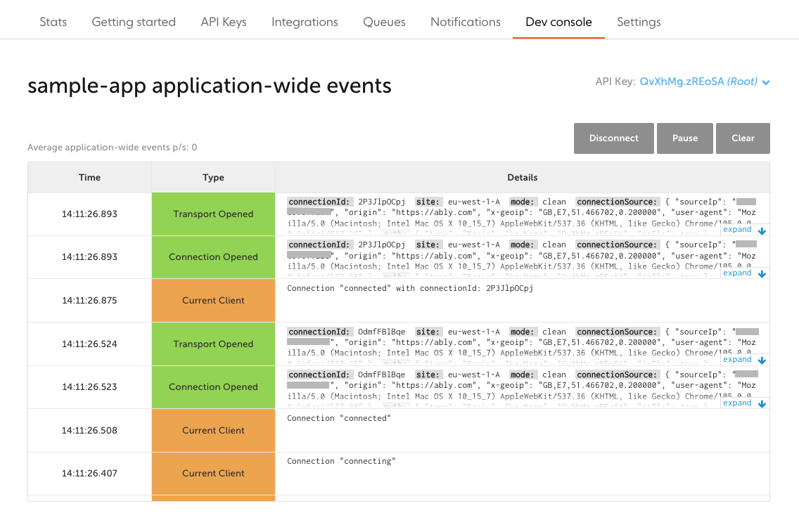
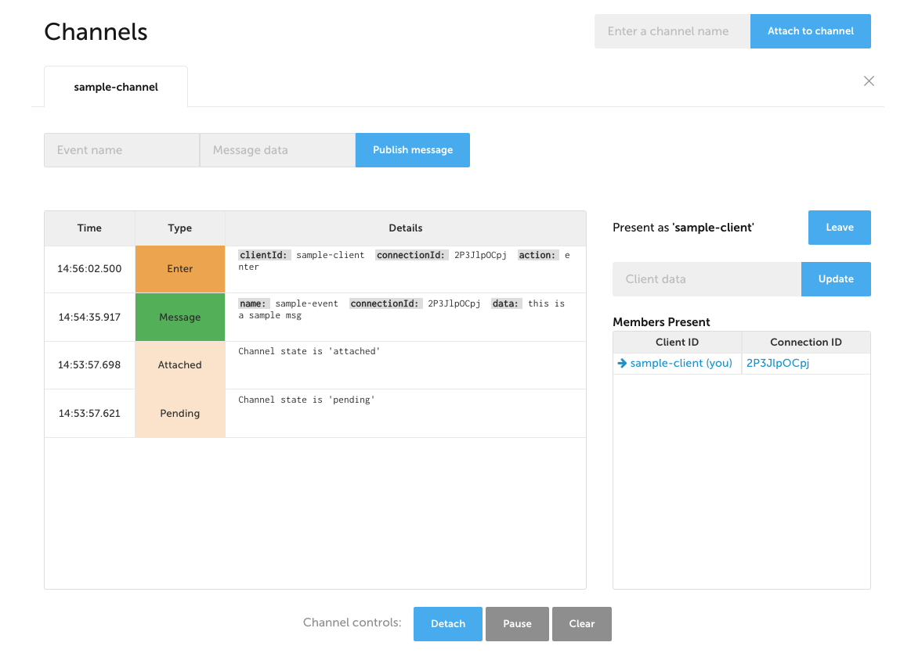
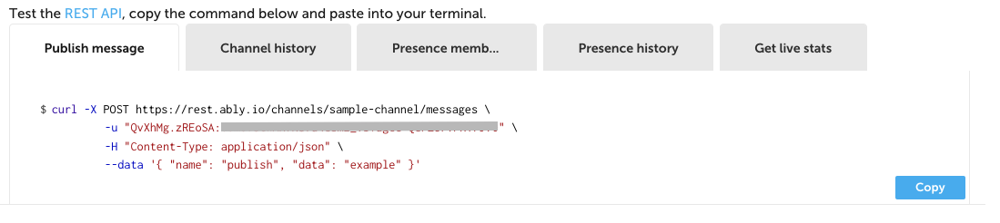

This topic lists some developer resources and tools you can use to increase your productivity with Ably.

## Ably for Visual Studio Code <a id="vscode-plugin"/>

Use the Ably for Visual Studio Code extension to manage your Ably apps directly in Visual Studio Code.

The extension enables you to:

* List all apps in your Ably account.
  * View API keys, queues and integration rules for each app.
  * Copy API keys to your clipboard.
* Create an Ably app.

[Find it here.](https://github.com/ably-labs/vscode-ably)

## Ably Terraform provider <a id="terraform-provider"/>

Terraform provider for Ably enables you to manage your Ably account using Infrastructure-as-Code (IaC), including managing your applications, namespaces, keys, queues, rules and more.

[Find it here.](https://github.com/ably/terraform-provider-ably)

## Ably Control API GitHub Action <a id="github-actions"/>

A GitHub Action to use the [Ably Control API](/docs/platform/account/control-api). You can use this action to:

* Create an Ably application.
* Add an API key to an application, with a list of capabilities.

[Find it here.](https://github.com/ably-labs/ably-control-api-action)

## Developer console <a id="developer-console"/>

The [Ably dashboard](https://ably.com/dashboard) contains a developer console. In the developer console you can view connection events. The following screenshot illustrates an example connection:

You can attach to a specific channel to view messages. You can also publish messages directly in the console:

The developer console provides you with some REST API Curl command snippets that can help you test out Ably quickly:

Note, for convenience, the Curl commands have your Ably credentials already added.

[Find it here.](https://ably.com/dashboard)
