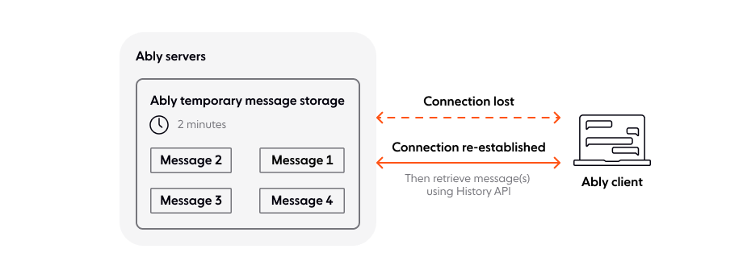
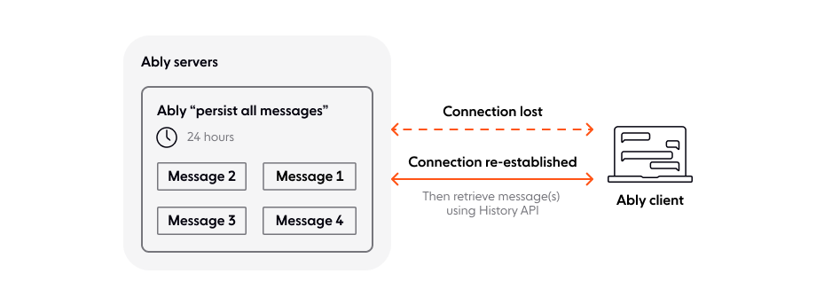
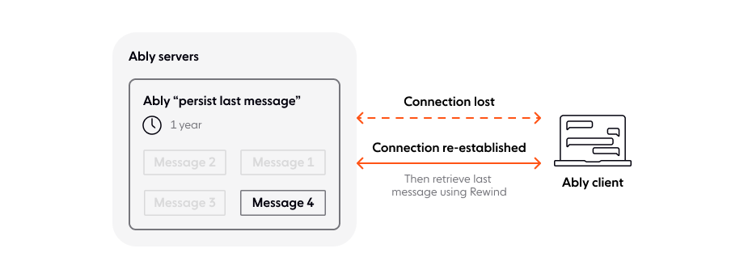

Ably stores all messages for two minutes by default. This can be increased up to a year, or longer, depending on your account package. It is also possible to persist the last message sent to a channel for a year. Ably [integrations](/docs/platform/integrations) can also be used to send messages outside of Ably for long-term storage.

## Default message storage - two minutes <a id="default-persistence"/>

The default message storage of two minutes enables clients that briefly disconnect from Ably to [automatically retrieve](/docs/connect/states) any messages they may have missed. These messages can also be retrieved using the [history](/docs/storage-history/history) feature, and this applies to both regular messages and [presence messages](/docs/presence-occupancy/presence).

<Aside data-type='see-evidence'>
Every message is redundantly stored across multiple isolated datacenters within your region before acknowledgment, preventing data loss. [Click here for evidence 🔬](https://ably.com/docs/platform/architecture/index.mdx)
</Aside>

The following diagram illustrates the default persistence of messages:

## Persist all messages <a id="all-message-persistence"/>

If you need to retain messages for longer than the default two minutes you can enable persisted history by setting a [channel rule](/docs/channels#rules). When persisted history is enabled for a channel any messages will be stored on disk. Note that this does not apply to [object messages](/docs/liveobjects).

The time that messages will be stored for depends on your account package:

| Package | Minimum | Maximum |
|---------|---------|---------|
| Free | 24 hours | 24 hours |
| PAYG | 72 hours | 365 days |
| Enterprise | 72 hours | Custom |

There is a cost associated with storing messages for longer than the minimum time period. [Contact us](https://ably.com/support) to discuss enabling long term storage.

### Message deletion <a id="message-deletion"/>

Ably does not currently provide an API to delete persisted messages from the history. Once messages are stored with persisted history enabled, they remain for the entire configured storage period. If you need to delete specific messages from history, [contact us](https://ably.com/support) to discuss requirements.

Messages can be retrieved using the [history](/docs/storage-history/history) feature. This is illustrated in the following diagram:

Note that every message that is persisted to, or retrieved from, disk counts as an extra message towards your monthly quota. For example, with persistence enabled a published message counts as two messages for your monthly quota. If the message is then retrieved another message will be deducted.

## Persist last message - 365 days <a id="persist-last-message"/>

You can persist just the last message sent to a channel for one year by setting a [channel rule](/docs/channels#rules). Note that this does not apply to [presence messages](/docs/presence-occupancy/presence) or [object messages](/docs/liveobjects).

Messages persisted for a year can be retrieved using the [rewind channel option](/docs/channels/options/rewind), or from the REST history API using [certain parameters](/docs/storage-history/history#channel-parameters).

The following diagram illustrates persisting the last message sent on a channel:

## Store messages outside of Ably <a id="outside-persistence"/>

[Integrations](/docs/platform/integrations) provide the ability to store your messages outside of Ably, for example in your own database or data warehouse.

Set up an integration rule to send messages to your own systems using [webhooks](/docs/platform/integrations/webhooks) or [serverless functions](/docs/platform/integrations/webhooks). Integration rules can additionally filter which messages sent to a channel should trigger these events.
